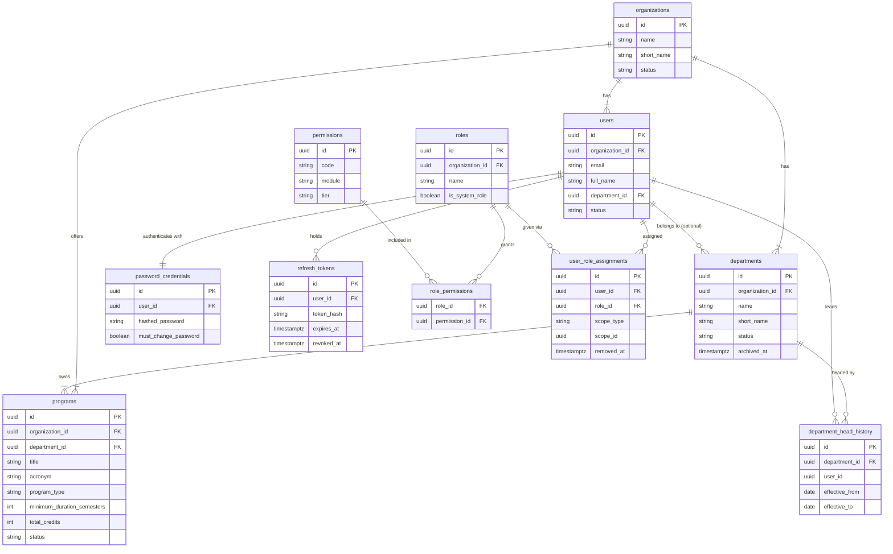
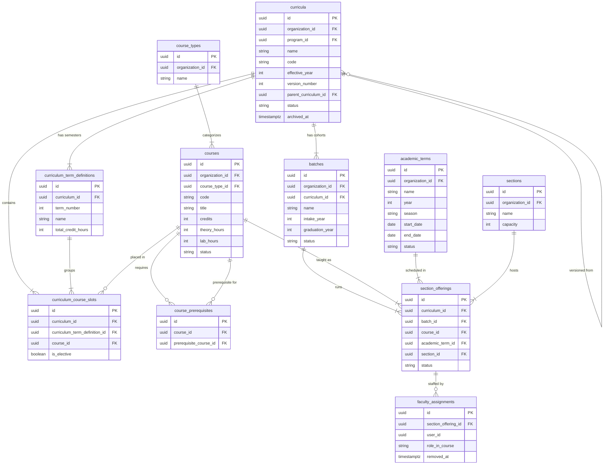
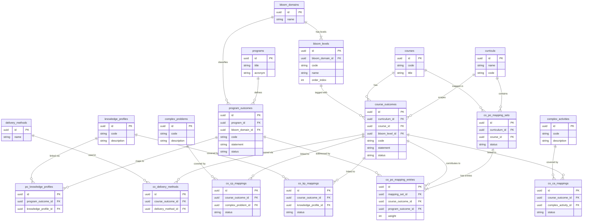
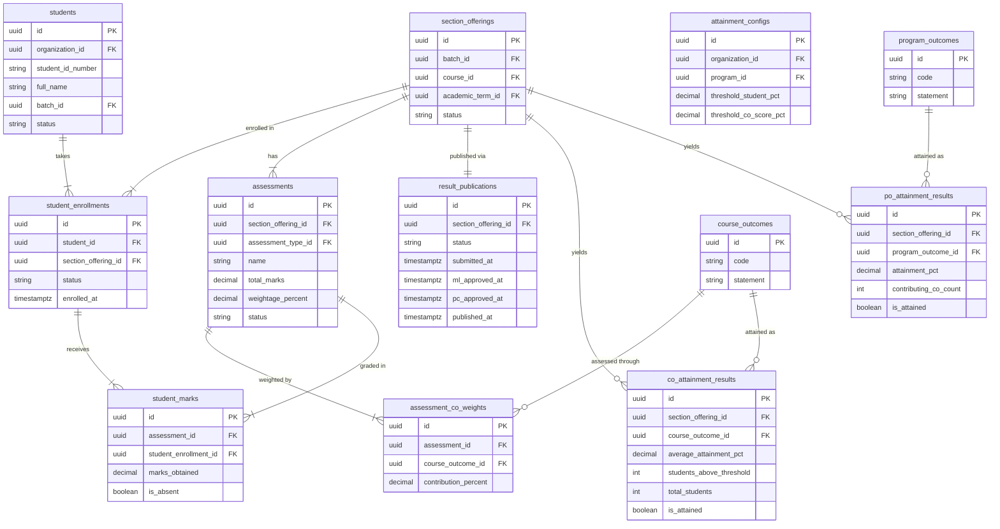
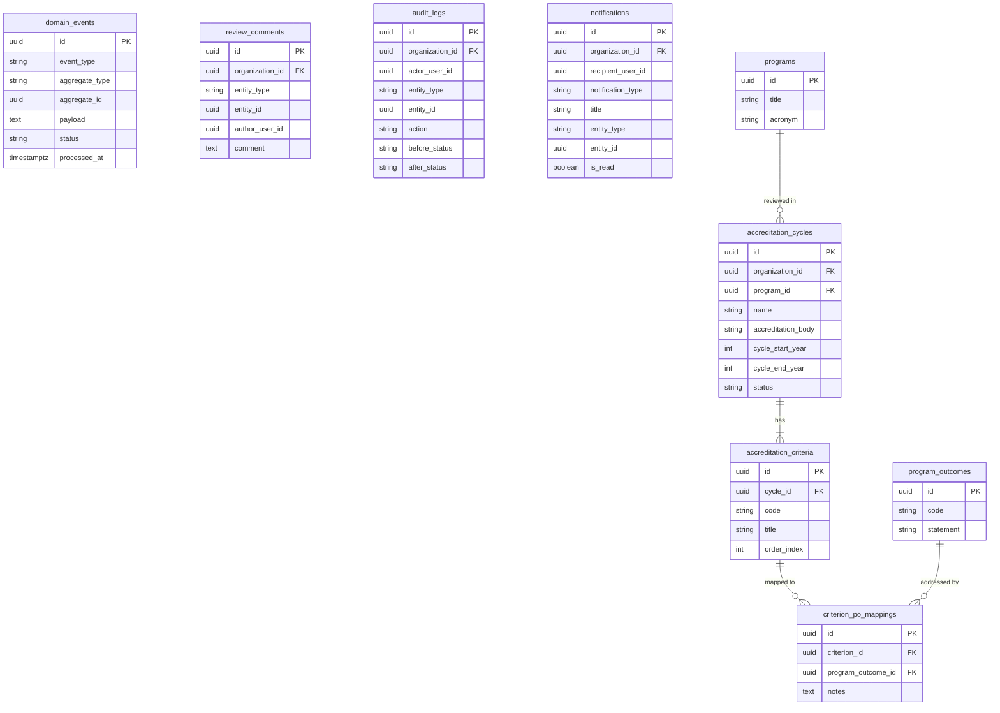
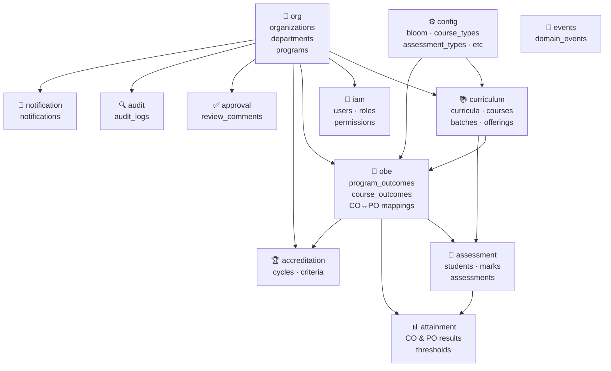

# Obelytics — Database Relationship Diagrams

## How to Visualize

| Tool | How |
|---|---|
| **VS Code** | Install extension **"Markdown Preview Mermaid Support"** → open this file → click Preview (`Ctrl+Shift+V`) |
| **GitHub** | Push this file — GitHub renders Mermaid automatically in any `.md` file |
| **Online (instant)** | Go to **[mermaid.live](https://mermaid.live)** → paste any code block below |
| **Notion** | Create a code block → set language to `mermaid` → paste the diagram |
| **dbdiagram.io** | Use the DBML export in `DATABASE_SCHEMA.md` as an alternative |

> Each diagram below is self-contained. Paste the ` ```mermaid ``` ` block into any of the tools above.

---

## Diagram 1 — Organization & Identity

Covers: `org` + `iam` schemas



---

## Diagram 2 — Curriculum Structure

Covers: `curriculum` schema (all 11 tables)



---

## Diagram 3 — Outcomes & Mappings (OBE)

Covers: `obe` schema + relevant `config` lookup tables



---

## Diagram 4 — Assessment & Attainment

Covers: `assessment` + `attainment` schemas



---

## Diagram 5 — Supporting Schemas

Covers: `events`, `approval`, `audit`, `notification`, `accreditation`



---

## Diagram 6 — High-Level Schema Overview

Shows how the 13 schemas relate to each other — no columns, just dependencies.


