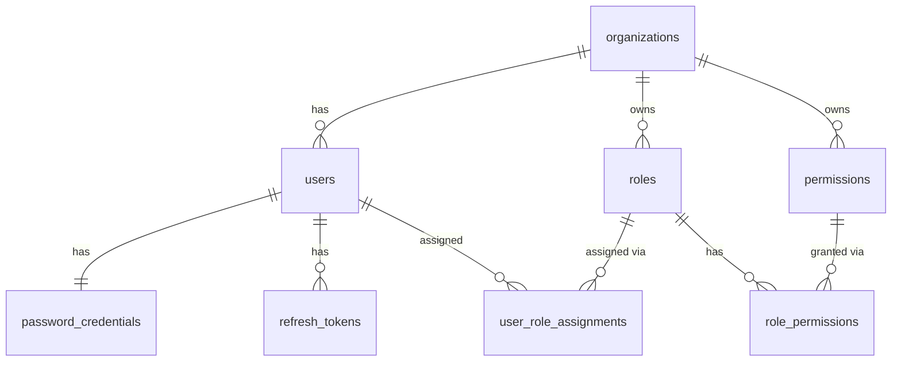
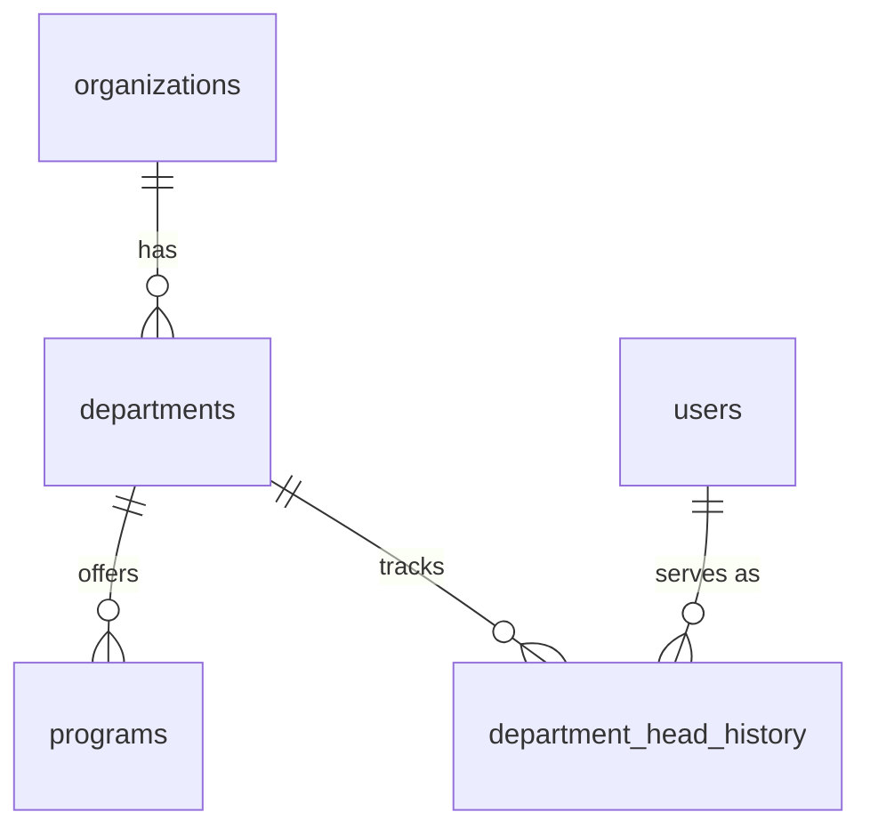
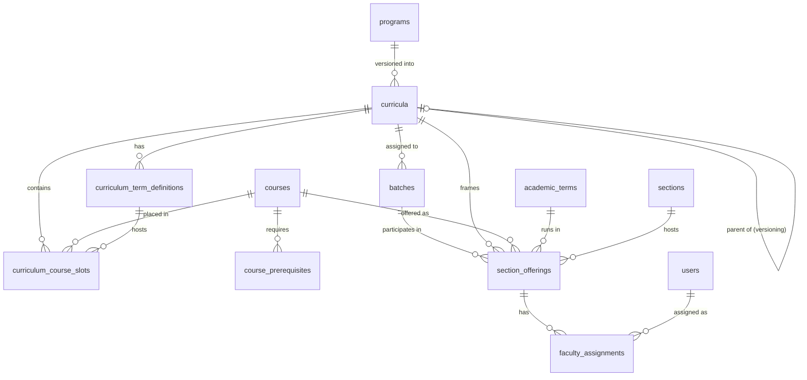
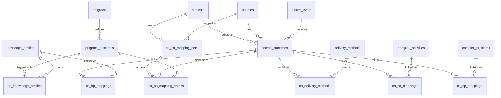
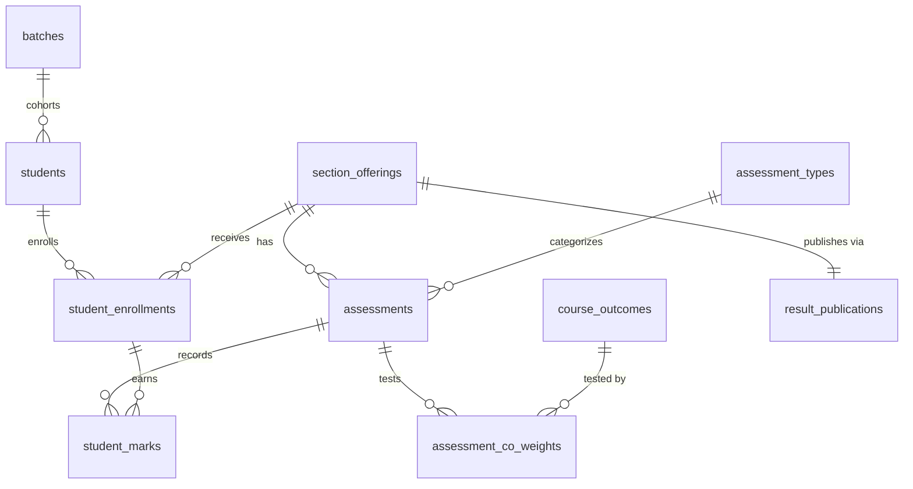
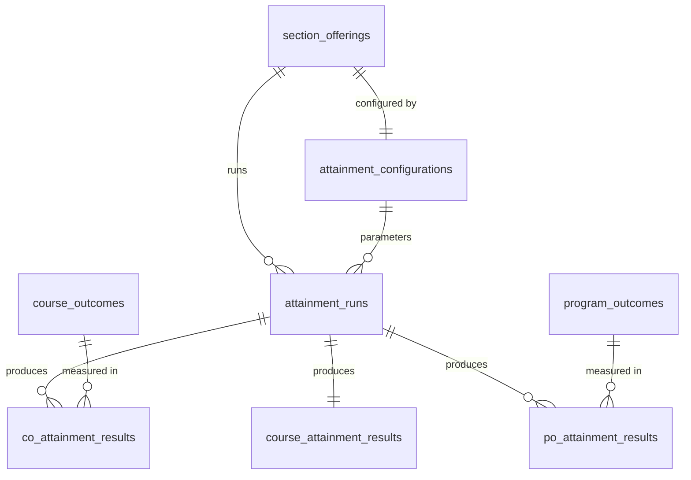
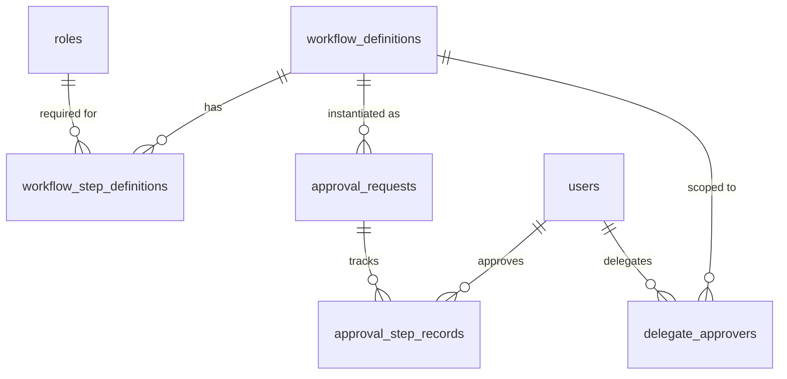

# OBE Accreditation Management Platform
## Database Architecture Document v1.0

> **Based on:** FRD v1.0 + DDD Analysis v1.0  
> **Database:** PostgreSQL 16+  
> **Date:** 2026-06-04  
> No SQL generated. Architecture only.

---

## Table of Contents

1. [Architectural Principles](#1-architectural-principles)
2. [Schema Organization](#2-schema-organization)
3. [Multi-Tenancy Design](#3-multi-tenancy-design)
4. [Soft Delete Strategy](#4-soft-delete-strategy)
5. [Audit Strategy](#5-audit-strategy)
6. [Versioning Strategy](#6-versioning-strategy)
7. [Schema Definitions](#7-schema-definitions)
   - [config](#71-config-schema)
   - [iam](#72-iam-schema)
   - [org](#73-org-schema)
   - [curriculum](#74-curriculum-schema)
   - [obe](#75-obe-schema)
   - [assessment](#76-assessment-schema)
   - [attainment](#77-attainment-schema)
   - [approval](#78-approval-schema)
   - [notification](#79-notification-schema)
   - [audit](#710-audit-schema)
   - [accreditation](#711-accreditation-schema)
   - [reporting](#712-reporting-schema)
8. [Entity Relationship Diagrams](#8-entity-relationship-diagrams)
9. [Complete Relationship Matrix](#9-complete-relationship-matrix)
10. [Indexing Strategy](#10-indexing-strategy)
11. [Constraint Summary](#11-constraint-summary)
12. [Cross-Schema Integration Points](#12-cross-schema-integration-points)

---

# 1. Architectural Principles

These principles govern every decision in this schema design. Any future change that violates a principle requires a formal architecture review.

| # | Principle | Rationale |
|---|---|---|
| P-01 | **Schema-per-bounded-context** | Each DDD bounded context owns its own PostgreSQL schema. No cross-schema JOINs in the ORM layer; cross-context data is accessed through application service interfaces or read models. |
| P-02 | **UUID primary keys everywhere** | All PKs are UUID v4. Prevents ID enumeration attacks, supports future merging of multi-tenant datasets, enables offline ID generation. |
| P-03 | **`organization_id` on all tenant-scoped tables** | Every table that holds institutional data carries `organization_id`. Enables future multi-tenancy via PostgreSQL Row-Level Security (RLS) without schema migration. |
| P-04 | **No physical deletes on referenced entities** | Any entity that has ever been referenced by another (FK relationship) is never hard-deleted. Archival is done through status columns only. |
| P-05 | **Append-only tables for immutable facts** | Audit events, published marks, and attainment results are append-only. No UPDATE or DELETE operations are permitted on these tables by the application. |
| P-06 | **Snapshot over live reference for calculations** | Attainment runs capture JSONB snapshots of mapping weights and assessment configurations at calculation time. Calculations never re-read live mapping tables. |
| P-07 | **Status over boolean flags** | Domain entities with lifecycle states use a `status VARCHAR` column with enforced enum-like values. Simple config entities use `is_active BOOLEAN`. |
| P-08 | **Timestamps on every table** | All tables carry `created_at TIMESTAMPTZ`. Mutable tables carry `updated_at TIMESTAMPTZ`. Immutable (append-only) tables carry only `created_at`. |
| P-09 | **Denormalize selectively in audit only** | The audit schema intentionally denormalizes actor email and entity display names. This ensures audit records remain readable even if referenced entities are later renamed or archived. |
| P-10 | **Partial indexes for active record queries** | All queries that filter by `status = 'ACTIVE'` or `is_active = TRUE` use partial indexes to avoid scanning archived rows. |

---

# 2. Schema Organization

PostgreSQL schemas map directly to bounded contexts. This enforces context isolation at the database level.

```
obelytics_db
│
├── config          — Configurable reference/lookup data (course types, bloom levels, etc.)
├── iam             — Identity, authentication, roles, permissions
├── org             — Organization, departments, programs
├── curriculum      — Curricula, courses, batches, academic structure, section offerings
├── obe             — Program outcomes, course outcomes, all CO mappings
├── assessment      — Assessments, student marks, result publication
├── attainment      — Attainment runs, CO/course/PO attainment results
├── approval        — Approval workflow definitions, requests, step records
├── notification    — Notification templates, queue, in-app inbox
├── audit           — Append-only audit event log
├── accreditation   — Accreditation bodies, cycles, reports
└── reporting       — Report definitions and run history
```

**Schema ownership rule:** An application module may only write to its own schema. Reading from another schema is allowed only through a dedicated read-model service or a view defined in a `_read` schema layer (introduced when CQRS is formalized).

---

# 3. Multi-Tenancy Design

## Current State: Single-Tenant Deployment

The first deployment serves a single institution. All rows across all tables share the same `organization_id`.

## Future State: Multi-Tenant Deployment

When multi-university support is required, isolation is enforced via **PostgreSQL Row-Level Security (RLS)**:

```
-- Pattern (conceptual):
CREATE POLICY org_isolation ON curriculum.curricula
  USING (organization_id = current_setting('app.current_organization_id')::uuid);
```

No migration is needed because `organization_id` is already on every table from day one.

## Tenancy Scope per Schema

| Schema | Tenant-Scoped? | Notes |
|---|---|---|
| `config` | Yes | Each org can have its own delivery methods, course types, etc. |
| `iam` | Yes | Users, roles, and permissions are per-org |
| `org` | Yes | Organizations are the tenant root themselves |
| `curriculum` | Yes | Curricula, courses, batches are per-org |
| `obe` | Yes | POs and COs belong to a program/course within an org |
| `assessment` | Yes | Assessments, marks are per-org |
| `attainment` | Yes | Attainment runs are per-org |
| `approval` | Yes | Workflows are per-org |
| `notification` | Yes | Notifications are per-org user |
| `audit` | Yes | Audit log is per-org (but `organization_id` can be null for system-level events) |
| `accreditation` | Yes | Accreditation cycles are per-org/program |
| `reporting` | Yes | Report runs are per-org |

## System-Level Permissions

A small set of system-defined permissions (e.g., `system.manage_organizations`) exist without an `organization_id`. These are used only by the platform super-admin and are stored in `iam.permissions` with `organization_id = NULL` and `tier = 'SYSTEM'`.

---

# 4. Soft Delete Strategy

The platform uses a **tiered archival model** — not a single `deleted_at` pattern. The strategy depends on the entity type.

## Tier 1 — Status-Managed Domain Entities

Entities with formal lifecycle state machines use a `status` column. Archival is a state transition, not a delete.

Applies to: `curricula`, `courses`, `programs`, `departments`, `program_outcomes`, `course_outcomes`, `batches`

```
status: DRAFT | ACTIVE | SUBMITTED | UNDER_REVIEW | APPROVED | PUBLISHED | LOCKED | ARCHIVED
```

- Archived rows are never deleted from the database.
- Archived rows remain accessible for historical reporting.
- Application layer excludes archived rows from selection lists via `WHERE status != 'ARCHIVED'`.
- Partial indexes enforce performant filtering.

## Tier 2 — Boolean-Managed Reference Data

Simple lookup/configuration tables that do not have complex lifecycle use `is_active BOOLEAN`.

Applies to: `config.*` tables, `iam.roles`, `iam.permissions`, `notification.notification_templates`

- `is_active = FALSE` hides the record from selection UI.
- Existing references to deactivated config records remain valid (historical integrity).
- No timestamps tracked for activation/deactivation changes (audit log captures this).

## Tier 3 — Timestamped Deactivation for Users and Assignments

Users are never deleted. Assignments are revoked with a timestamp.

Applies to: `iam.users`, `iam.user_role_assignments`, `curriculum.faculty_assignments`, `approval.delegate_approvers`

```
status: ACTIVE | DEACTIVATED         (for users)
revoked_at TIMESTAMPTZ NULL          (for assignments — null means currently active)
removed_at TIMESTAMPTZ NULL          (for faculty assignments)
```

- Partial unique indexes use `WHERE revoked_at IS NULL` to enforce active-assignment uniqueness.

## Tier 4 — Append-Only (No Delete at All)

Immutable records that must never be altered or deleted:

Applies to: `audit.audit_events`, `assessment.student_marks` (after publication), `attainment.*_results`

- No `deleted_at` column exists.
- Application-level guards prevent UPDATE or DELETE via the ORM layer.
- Database-level: table ownership and GRANT rules remove DELETE privilege from the application role.

## Cascade Policy

**No CASCADE DELETE is defined anywhere in this schema.** All FK constraints use `ON DELETE RESTRICT` (the default). If an attempt is made to delete a row that is still referenced, the database will refuse. This is the intended behavior — it forces the application to go through proper archival workflows.

---

# 5. Audit Strategy

## What Is Audited

Every state-changing operation across all domain entities is captured in `audit.audit_events`. This includes:

- CREATE, UPDATE, ARCHIVE operations on any domain entity
- State transitions (e.g., CO moving from SUBMITTED to APPROVED)
- Login/logout events
- Permission grants and revocations
- Result publication and attainment publication

## Audit Record Structure

Each audit record captures:

| Field | Purpose |
|---|---|
| `actor_user_id` | Who performed the action (UUID, denormalized — no FK) |
| `actor_email` | Snapshot of actor's email at time of action |
| `action` | Verb: CREATE, UPDATE, ARCHIVE, APPROVE, REJECT, PUBLISH, LOCK, LOGIN |
| `entity_type` | Which type of entity was affected (e.g., `course_outcomes`) |
| `entity_id` | UUID of the affected entity |
| `entity_display_name` | Human-readable snapshot (e.g., "CO1 - Apply OOP concepts") |
| `old_value` | JSONB snapshot of the entity state before the change |
| `new_value` | JSONB snapshot of the entity state after the change |
| `ip_address` | Client IP (for security audit trail) |
| `occurred_at` | Timestamp with timezone |

## Denormalization Intent

`actor_email` and `entity_display_name` are intentionally denormalized. If a user is later deactivated or an entity is renamed, the audit record remains fully self-describing without requiring a JOIN to reconstruct what happened.

## Append-Only Enforcement

- The `audit` schema's tables have no UPDATE or DELETE permissions granted to the application database role.
- Only an INSERT permission is granted on `audit.audit_events`.
- Audit writes are triggered by the application service layer (not database triggers — triggers make testing harder and hide business logic).

## Partitioning for Scale

`audit.audit_events` is **range-partitioned by `occurred_at`** using PostgreSQL declarative partitioning, with monthly or quarterly partitions. This keeps index sizes manageable as the audit log grows over years of operation.

---

# 6. Versioning Strategy

Three distinct versioning problems exist in this platform, each solved differently.

## 6.1 Curriculum Versioning

When a curriculum needs to change after batches have been assigned, a new version is created rather than mutating the existing one.

**Mechanism:**
- `curriculum.curricula` has a `version_number SMALLINT` and a `parent_curriculum_id UUID` self-reference.
- A new version is a new row with `parent_curriculum_id` pointing to its predecessor.
- All curriculum-scoped entities (course slots, term definitions, COs, CO-PO mappings) reference `curriculum_id` — so they are automatically version-isolated.
- Batches reference a specific `curriculum_id`, anchoring them to one version forever.

**Version lineage example:**

```
curricula
  id: A   program: CSE   version: 1   parent: NULL       status: ARCHIVED
  id: B   program: CSE   version: 2   parent: A          status: ACTIVE    ← Batch 66
  id: C   program: CSE   version: 3   parent: B          status: ACTIVE    ← Batch 67
```

## 6.2 Course Outcome Versioning

COs are curriculum-version-scoped. When a curriculum is versioned, the coordinator creates new COs for the new curriculum (potentially copying and editing prior COs). Old COs remain associated with their curriculum version and are LOCKED after attainment publication.

There is no CO mutation history stored at the row level — the audit log provides the full change history for each CO by querying `audit.audit_events WHERE entity_type = 'course_outcomes' AND entity_id = :co_id`.

## 6.3 Attainment Snapshot Versioning

Attainment calculations must be reproducible. An `attainment_run` stores two JSONB snapshots at the time of calculation:

- **`co_po_mapping_snapshot`**: The full CO×PO weight matrix as it existed when the run was initiated.
- **`assessment_weight_snapshot`**: The assessment-to-CO contribution weights for this section offering.

If a mapping is later corrected (e.g., a typo in PO weight), the historical run remains accurate because it used the snapshot, not the live data. A new run must be initiated to reflect corrected mappings.

## 6.4 No Temporal Tables

PostgreSQL temporal tables (bi-temporal modeling) are not used. The combination of curriculum versioning + audit log + attainment snapshots covers all historical reconstruction needs without the complexity of system-time and valid-time management.

---

# 7. Schema Definitions

> **Column notation:**
> - `PK` — Primary Key
> - `FK → table.column` — Foreign Key reference
> - `UQ` — Unique constraint (listed separately if composite)
> - `NN` — Not Null
> - `*` — Indexed (additional index beyond PK/FK)

---

## 7.1 config Schema

Configurable reference/lookup data. All tables are tenant-scoped via `organization_id`.

---

### config.bloom_domains

Cognitive, Affective, Psychomotor domains for Bloom's taxonomy.

| Column | Type | Constraints | Notes |
|---|---|---|---|
| `id` | UUID | PK, NN | |
| `organization_id` | UUID | FK → org.organizations.id, NN, * | Tenant scope |
| `name` | VARCHAR(100) | NN | e.g., Cognitive |
| `description` | TEXT | | |
| `is_active` | BOOLEAN | NN, DEFAULT TRUE | |
| `created_at` | TIMESTAMPTZ | NN | |
| `updated_at` | TIMESTAMPTZ | NN | |

**Unique Constraints:** `(organization_id, name)`

---

### config.bloom_levels

Individual Bloom levels within a domain (C1–C6, A1–A5, P1–P5).

| Column | Type | Constraints | Notes |
|---|---|---|---|
| `id` | UUID | PK, NN | |
| `organization_id` | UUID | FK → org.organizations.id, NN | |
| `bloom_domain_id` | UUID | FK → config.bloom_domains.id, NN, * | |
| `code` | VARCHAR(10) | NN | e.g., C1, C2 |
| `name` | VARCHAR(100) | NN | e.g., Remember |
| `order_index` | SMALLINT | NN | Display/ranking order |
| `is_active` | BOOLEAN | NN, DEFAULT TRUE | |
| `created_at` | TIMESTAMPTZ | NN | |
| `updated_at` | TIMESTAMPTZ | NN | |

**Unique Constraints:** `(organization_id, bloom_domain_id, code)`

---

### config.delivery_methods

Teaching delivery methods (Lecture, Discussion, Group Work, etc.).

| Column | Type | Constraints | Notes |
|---|---|---|---|
| `id` | UUID | PK, NN | |
| `organization_id` | UUID | FK → org.organizations.id, NN | |
| `name` | VARCHAR(100) | NN | |
| `description` | TEXT | | |
| `is_active` | BOOLEAN | NN, DEFAULT TRUE | |
| `created_at` | TIMESTAMPTZ | NN | |
| `updated_at` | TIMESTAMPTZ | NN | |

**Unique Constraints:** `(organization_id, name)`

---

### config.course_types

Theory, Lab, Project, Thesis, Internship, etc.

| Column | Type | Constraints | Notes |
|---|---|---|---|
| `id` | UUID | PK, NN | |
| `organization_id` | UUID | FK → org.organizations.id, NN | |
| `name` | VARCHAR(100) | NN | |
| `description` | TEXT | | |
| `is_active` | BOOLEAN | NN, DEFAULT TRUE | |
| `created_at` | TIMESTAMPTZ | NN | |
| `updated_at` | TIMESTAMPTZ | NN | |

**Unique Constraints:** `(organization_id, name)`

---

### config.assessment_types

Quiz, Assignment, Lab, Midterm, Final, Project, Presentation, Viva, etc.

| Column | Type | Constraints | Notes |
|---|---|---|---|
| `id` | UUID | PK, NN | |
| `organization_id` | UUID | FK → org.organizations.id, NN | |
| `name` | VARCHAR(100) | NN | |
| `is_sessional` | BOOLEAN | NN, DEFAULT FALSE | Distinguishes sessional vs terminal |
| `is_active` | BOOLEAN | NN, DEFAULT TRUE | |
| `created_at` | TIMESTAMPTZ | NN | |
| `updated_at` | TIMESTAMPTZ | NN | |

**Unique Constraints:** `(organization_id, name)`

---

### config.complex_problems

CP reference codes for CO-CP mapping.

| Column | Type | Constraints | Notes |
|---|---|---|---|
| `id` | UUID | PK, NN | |
| `organization_id` | UUID | FK → org.organizations.id, NN | |
| `code` | VARCHAR(20) | NN | e.g., CP1, CP2 |
| `description` | TEXT | NN | |
| `is_active` | BOOLEAN | NN, DEFAULT TRUE | |
| `created_at` | TIMESTAMPTZ | NN | |
| `updated_at` | TIMESTAMPTZ | NN | |

**Unique Constraints:** `(organization_id, code)`

---

### config.complex_activities

CA reference codes for CO-CA mapping.

| Column | Type | Constraints | Notes |
|---|---|---|---|
| `id` | UUID | PK, NN | |
| `organization_id` | UUID | FK → org.organizations.id, NN | |
| `code` | VARCHAR(20) | NN | |
| `description` | TEXT | NN | |
| `is_active` | BOOLEAN | NN, DEFAULT TRUE | |
| `created_at` | TIMESTAMPTZ | NN | |
| `updated_at` | TIMESTAMPTZ | NN | |

**Unique Constraints:** `(organization_id, code)`

---

### config.knowledge_profiles

KP reference codes for CO-KP and PO-KP mapping.

| Column | Type | Constraints | Notes |
|---|---|---|---|
| `id` | UUID | PK, NN | |
| `organization_id` | UUID | FK → org.organizations.id, NN | |
| `code` | VARCHAR(20) | NN | |
| `description` | TEXT | NN | |
| `is_active` | BOOLEAN | NN, DEFAULT TRUE | |
| `created_at` | TIMESTAMPTZ | NN | |
| `updated_at` | TIMESTAMPTZ | NN | |

**Unique Constraints:** `(organization_id, code)`

---

### config.mapping_weight_labels

Human-readable labels for mapping weights (1=Low, 2=Medium, 3=High). Configurable per org.

| Column | Type | Constraints | Notes |
|---|---|---|---|
| `id` | UUID | PK, NN | |
| `organization_id` | UUID | FK → org.organizations.id, NN | |
| `weight_value` | SMALLINT | NN | Must be 1, 2, or 3 |
| `label` | VARCHAR(50) | NN | Low, Medium, High |
| `created_at` | TIMESTAMPTZ | NN | |
| `updated_at` | TIMESTAMPTZ | NN | |

**Unique Constraints:** `(organization_id, weight_value)`
**Check Constraint:** `weight_value IN (1, 2, 3)`

---

## 7.2 iam Schema

Identity, authentication, authorization.

---

### iam.users

All human actors in the system. One table covers faculty, coordinators, super admins. Student identities are in `assessment.students`.

| Column | Type | Constraints | Notes |
|---|---|---|---|
| `id` | UUID | PK, NN | |
| `organization_id` | UUID | FK → org.organizations.id, NN, * | |
| `faculty_type` | VARCHAR(30) | | PERMANENT, ADJUNCT, VISITING, CONTRACTUAL |
| `title` | VARCHAR(20) | | Dr., Prof., Mr., Ms. |
| `first_name` | VARCHAR(100) | NN | |
| `last_name` | VARCHAR(100) | NN | |
| `email` | VARCHAR(255) | NN, * | Validated against org regex |
| `contact_number` | VARCHAR(30) | | |
| `department_id` | UUID | FK → org.departments.id, * | Nullable for super admins |
| `designation` | VARCHAR(150) | | |
| `status` | VARCHAR(20) | NN, DEFAULT 'ACTIVE' | ACTIVE, DEACTIVATED |
| `deactivated_at` | TIMESTAMPTZ | | |
| `email_verified_at` | TIMESTAMPTZ | | |
| `created_at` | TIMESTAMPTZ | NN | |
| `updated_at` | TIMESTAMPTZ | NN | |

**Unique Constraints:** `(organization_id, email)` — email is unique per org (not globally, for future multi-tenancy)

---

### iam.password_credentials

Separated from users for security hygiene. One credential record per user.

| Column | Type | Constraints | Notes |
|---|---|---|---|
| `id` | UUID | PK, NN | |
| `user_id` | UUID | FK → iam.users.id, NN, UNIQUE | 1:1 with user |
| `password_hash` | VARCHAR(255) | NN | bcrypt hash |
| `reset_token_hash` | VARCHAR(255) | | Hashed one-time reset token |
| `reset_token_expires_at` | TIMESTAMPTZ | | |
| `last_changed_at` | TIMESTAMPTZ | NN | |
| `created_at` | TIMESTAMPTZ | NN | |
| `updated_at` | TIMESTAMPTZ | NN | |

---

### iam.refresh_tokens

JWT refresh token management. Multiple active tokens per user (multi-device).

| Column | Type | Constraints | Notes |
|---|---|---|---|
| `id` | UUID | PK, NN | |
| `user_id` | UUID | FK → iam.users.id, NN, * | |
| `token_hash` | VARCHAR(255) | NN, UNIQUE | SHA-256 hash of the token |
| `expires_at` | TIMESTAMPTZ | NN, * | Indexed for expiry cleanup job |
| `revoked_at` | TIMESTAMPTZ | | Null = still valid |
| `device_fingerprint` | VARCHAR(255) | | Browser/device identifier |
| `created_at` | TIMESTAMPTZ | NN | |

**Composite Index:** `(user_id, expires_at)` WHERE `revoked_at IS NULL`

---

### iam.roles

Roles are fully dynamic — new roles can be created by super admin without code changes.

| Column | Type | Constraints | Notes |
|---|---|---|---|
| `id` | UUID | PK, NN | |
| `organization_id` | UUID | FK → org.organizations.id | Null for system roles |
| `name` | VARCHAR(100) | NN | e.g., Program Coordinator |
| `description` | TEXT | | |
| `is_system_role` | BOOLEAN | NN, DEFAULT FALSE | System roles cannot be deleted |
| `is_active` | BOOLEAN | NN, DEFAULT TRUE | |
| `created_at` | TIMESTAMPTZ | NN | |
| `updated_at` | TIMESTAMPTZ | NN | |

**Unique Constraints:** `(organization_id, name)`

---

### iam.permissions

Two-tier permission model: SYSTEM permissions (hardcoded codes, enforced in application) and CUSTOM permissions (coordinator-created, soft-policy enforced).

| Column | Type | Constraints | Notes |
|---|---|---|---|
| `id` | UUID | PK, NN | |
| `organization_id` | UUID | FK → org.organizations.id | Null for SYSTEM tier |
| `code` | VARCHAR(150) | NN | e.g., `curriculum.create`, `user.deactivate` |
| `description` | TEXT | | |
| `tier` | VARCHAR(10) | NN | SYSTEM or CUSTOM |
| `is_active` | BOOLEAN | NN, DEFAULT TRUE | |
| `created_at` | TIMESTAMPTZ | NN | |

**Unique Constraints:**
- `(code)` WHERE `tier = 'SYSTEM'` — system permission codes are globally unique
- `(organization_id, code)` WHERE `tier = 'CUSTOM'`

---

### iam.role_permissions

Junction table: many-to-many between roles and permissions.

| Column | Type | Constraints | Notes |
|---|---|---|---|
| `id` | UUID | PK, NN | |
| `role_id` | UUID | FK → iam.roles.id, NN, * | |
| `permission_id` | UUID | FK → iam.permissions.id, NN, * | |
| `granted_at` | TIMESTAMPTZ | NN | |
| `granted_by_user_id` | UUID | FK → iam.users.id | Nullable for seeded data |

**Unique Constraints:** `(role_id, permission_id)`

---

### iam.user_role_assignments

Scoped role assignments. A user can be a Program Coordinator for CSE but a Section Teacher for ECE.

| Column | Type | Constraints | Notes |
|---|---|---|---|
| `id` | UUID | PK, NN | |
| `user_id` | UUID | FK → iam.users.id, NN, * | |
| `role_id` | UUID | FK → iam.roles.id, NN, * | |
| `scope_type` | VARCHAR(20) | NN | GLOBAL, DEPARTMENT, PROGRAM |
| `scope_id` | UUID | | References dept or program ID; null for GLOBAL |
| `assigned_at` | TIMESTAMPTZ | NN | |
| `assigned_by_user_id` | UUID | FK → iam.users.id | |
| `revoked_at` | TIMESTAMPTZ | | Null = currently active |

**Unique Constraint (Partial):** `(user_id, role_id, scope_type, scope_id)` WHERE `revoked_at IS NULL`

---

## 7.3 org Schema

---

### org.organizations

Single instance per deployment. The tenant root.

| Column | Type | Constraints | Notes |
|---|---|---|---|
| `id` | UUID | PK, NN | |
| `name` | VARCHAR(255) | NN | |
| `short_name` | VARCHAR(50) | NN, UNIQUE | |
| `description` | TEXT | | |
| `vision` | TEXT | | |
| `mission` | TEXT | | |
| `logo_file_key` | VARCHAR(500) | | MinIO object key |
| `website` | VARCHAR(255) | | |
| `address_street` | VARCHAR(255) | | |
| `address_city` | VARCHAR(100) | | |
| `address_country` | VARCHAR(100) | | |
| `address_postal_code` | VARCHAR(20) | | |
| `contact_email` | VARCHAR(255) | | |
| `contact_phone` | VARCHAR(50) | | |
| `email_validation_regex` | VARCHAR(500) | | Configurable; applied to new user creation |
| `status` | VARCHAR(20) | NN, DEFAULT 'ACTIVE' | ACTIVE only for now |
| `created_at` | TIMESTAMPTZ | NN | |
| `updated_at` | TIMESTAMPTZ | NN | |

---

### org.departments

| Column | Type | Constraints | Notes |
|---|---|---|---|
| `id` | UUID | PK, NN | |
| `organization_id` | UUID | FK → org.organizations.id, NN, * | |
| `name` | VARCHAR(200) | NN | |
| `short_name` | VARCHAR(30) | NN | |
| `year_established` | SMALLINT | | |
| `description` | TEXT | | |
| `vision` | TEXT | | |
| `mission` | TEXT | | |
| `status` | VARCHAR(20) | NN, DEFAULT 'ACTIVE' | ACTIVE, ARCHIVED |
| `archived_at` | TIMESTAMPTZ | | |
| `created_at` | TIMESTAMPTZ | NN | |
| `updated_at` | TIMESTAMPTZ | NN | |

**Unique Constraint (Partial):** `(organization_id, short_name)` WHERE `status = 'ACTIVE'`

---

### org.department_head_history

Tracks the full HOD history for a department.

| Column | Type | Constraints | Notes |
|---|---|---|---|
| `id` | UUID | PK, NN | |
| `department_id` | UUID | FK → org.departments.id, NN, * | |
| `user_id` | UUID | FK → iam.users.id, NN | |
| `effective_from` | DATE | NN | |
| `effective_to` | DATE | | Null = current HOD |
| `created_at` | TIMESTAMPTZ | NN | |

**Unique Constraint (Partial):** `(department_id)` WHERE `effective_to IS NULL` — only one current HOD

---

### org.programs

| Column | Type | Constraints | Notes |
|---|---|---|---|
| `id` | UUID | PK, NN | |
| `organization_id` | UUID | FK → org.organizations.id, NN, * | |
| `department_id` | UUID | FK → org.departments.id, NN, * | |
| `title` | VARCHAR(255) | NN | |
| `acronym` | VARCHAR(20) | NN | e.g., CSE, EEE |
| `program_type` | VARCHAR(20) | NN | UNDERGRADUATE, POSTGRADUATE, PHD |
| `minimum_duration_semesters` | SMALLINT | NN | |
| `total_credits` | SMALLINT | NN | |
| `study_mode` | VARCHAR(20) | NN | FULL_TIME, PART_TIME |
| `description` | TEXT | | |
| `status` | VARCHAR(20) | NN, DEFAULT 'ACTIVE' | ACTIVE, ARCHIVED |
| `archived_at` | TIMESTAMPTZ | | |
| `created_at` | TIMESTAMPTZ | NN | |
| `updated_at` | TIMESTAMPTZ | NN | |

**Unique Constraint (Partial):** `(organization_id, acronym)` WHERE `status = 'ACTIVE'`

---

## 7.4 curriculum Schema

---

### curriculum.curricula

Curriculum versions. Parent-child self-reference for version lineage.

| Column | Type | Constraints | Notes |
|---|---|---|---|
| `id` | UUID | PK, NN | |
| `organization_id` | UUID | FK → org.organizations.id, NN, * | |
| `program_id` | UUID | FK → org.programs.id, NN, * | |
| `name` | VARCHAR(255) | NN | e.g., B.Sc. CSE 2026 |
| `code` | VARCHAR(50) | NN | e.g., CSE-2026 |
| `effective_year` | SMALLINT | NN | |
| `version_number` | SMALLINT | NN, DEFAULT 1 | Increments per versioning event |
| `parent_curriculum_id` | UUID | FK → curriculum.curricula.id | Null for first version |
| `status` | VARCHAR(20) | NN, DEFAULT 'DRAFT' | DRAFT, ACTIVE, VERSIONED, ARCHIVED |
| `created_at` | TIMESTAMPTZ | NN | |
| `updated_at` | TIMESTAMPTZ | NN | |

**Unique Constraints:** `(program_id, code, version_number)`

---

### curriculum.curriculum_term_definitions

Structural semester slots within a curriculum (Semester 1, Semester 2, ...).

| Column | Type | Constraints | Notes |
|---|---|---|---|
| `id` | UUID | PK, NN | |
| `curriculum_id` | UUID | FK → curriculum.curricula.id, NN, * | |
| `term_number` | SMALLINT | NN | 1, 2, 3... |
| `name` | VARCHAR(100) | NN | Semester 1, Year 1 Term 2 |
| `total_credit_hours` | SMALLINT | | |
| `created_at` | TIMESTAMPTZ | NN | |

**Unique Constraints:** `(curriculum_id, term_number)`

---

### curriculum.courses

Course definitions. Independent of curriculum — the same course can appear in multiple curriculum versions.

| Column | Type | Constraints | Notes |
|---|---|---|---|
| `id` | UUID | PK, NN | |
| `organization_id` | UUID | FK → org.organizations.id, NN, * | |
| `course_type_id` | UUID | FK → config.course_types.id, NN | |
| `code` | VARCHAR(30) | NN | e.g., CSE101 |
| `title` | VARCHAR(255) | NN | |
| `credits` | SMALLINT | NN | |
| `theory_hours` | SMALLINT | NN, DEFAULT 0 | Per week |
| `lab_hours` | SMALLINT | NN, DEFAULT 0 | Per week |
| `description` | TEXT | | |
| `status` | VARCHAR(20) | NN, DEFAULT 'ACTIVE' | ACTIVE, ARCHIVED |
| `archived_at` | TIMESTAMPTZ | | |
| `created_at` | TIMESTAMPTZ | NN | |
| `updated_at` | TIMESTAMPTZ | NN | |

**Unique Constraint (Partial):** `(organization_id, code)` WHERE `status = 'ACTIVE'`

---

### curriculum.curriculum_course_slots

A course placed within a curriculum term. The junction between curricula and courses.

| Column | Type | Constraints | Notes |
|---|---|---|---|
| `id` | UUID | PK, NN | |
| `curriculum_id` | UUID | FK → curriculum.curricula.id, NN, * | |
| `curriculum_term_definition_id` | UUID | FK → curriculum.curriculum_term_definitions.id, NN | |
| `course_id` | UUID | FK → curriculum.courses.id, NN, * | |
| `is_elective` | BOOLEAN | NN, DEFAULT FALSE | |
| `created_at` | TIMESTAMPTZ | NN | |

**Unique Constraints:** `(curriculum_id, course_id)` — a course appears once per curriculum version

---

### curriculum.course_prerequisites

Directed graph edges representing prerequisite relationships between courses.

| Column | Type | Constraints | Notes |
|---|---|---|---|
| `id` | UUID | PK, NN | |
| `organization_id` | UUID | FK → org.organizations.id, NN | |
| `course_id` | UUID | FK → curriculum.courses.id, NN, * | The course that has the prerequisite |
| `prerequisite_course_id` | UUID | FK → curriculum.courses.id, NN | The required course |
| `created_at` | TIMESTAMPTZ | NN | |

**Unique Constraints:** `(course_id, prerequisite_course_id)`
**Check Constraint:** `course_id != prerequisite_course_id` — no self-prerequisites
**Note:** Cycle detection is enforced at the application service layer on every INSERT.

---

### curriculum.batches

A cohort of students assigned to a specific curriculum version.

| Column | Type | Constraints | Notes |
|---|---|---|---|
| `id` | UUID | PK, NN | |
| `organization_id` | UUID | FK → org.organizations.id, NN, * | |
| `curriculum_id` | UUID | FK → curriculum.curricula.id, NN, * | Pinned to a specific version |
| `name` | VARCHAR(100) | NN | e.g., Batch 66 |
| `intake_year` | SMALLINT | NN | |
| `graduation_year` | SMALLINT | | |
| `status` | VARCHAR(20) | NN, DEFAULT 'ACTIVE' | ACTIVE, GRADUATED, ARCHIVED |
| `created_at` | TIMESTAMPTZ | NN | |
| `updated_at` | TIMESTAMPTZ | NN | |

**Unique Constraints:** `(curriculum_id, name)`

---

### curriculum.academic_terms

Operational running terms (Spring 2026, Fall 2026). Distinct from structural term definitions.

| Column | Type | Constraints | Notes |
|---|---|---|---|
| `id` | UUID | PK, NN | |
| `organization_id` | UUID | FK → org.organizations.id, NN, * | |
| `name` | VARCHAR(100) | NN | Spring 2026, Fall 2026 |
| `year` | SMALLINT | NN | |
| `season` | VARCHAR(20) | NN | SPRING, SUMMER, FALL, WINTER |
| `start_date` | DATE | NN | |
| `end_date` | DATE | NN | |
| `status` | VARCHAR(20) | NN, DEFAULT 'UPCOMING' | UPCOMING, ACTIVE, COMPLETED |
| `created_at` | TIMESTAMPTZ | NN | |
| `updated_at` | TIMESTAMPTZ | NN | |

**Unique Constraints:** `(organization_id, year, season)`

---

### curriculum.sections

Section definitions (Section A, Section B). Reusable across terms.

| Column | Type | Constraints | Notes |
|---|---|---|---|
| `id` | UUID | PK, NN | |
| `organization_id` | UUID | FK → org.organizations.id, NN | |
| `name` | VARCHAR(50) | NN | Section A, Section B |
| `capacity` | SMALLINT | | Max student count |
| `created_at` | TIMESTAMPTZ | NN | |

**Unique Constraints:** `(organization_id, name)`

---

### curriculum.section_offerings

The atomic unit of course delivery: a specific course, in a specific section, for a specific batch, in a specific operational term. This is the SectionOffering aggregate that owns assessments and attainment.

| Column | Type | Constraints | Notes |
|---|---|---|---|
| `id` | UUID | PK, NN | |
| `organization_id` | UUID | FK → org.organizations.id, NN, * | |
| `curriculum_id` | UUID | FK → curriculum.curricula.id, NN | |
| `batch_id` | UUID | FK → curriculum.batches.id, NN, * | |
| `course_id` | UUID | FK → curriculum.courses.id, NN, * | |
| `academic_term_id` | UUID | FK → curriculum.academic_terms.id, NN, * | |
| `section_id` | UUID | FK → curriculum.sections.id, NN | |
| `status` | VARCHAR(20) | NN, DEFAULT 'UPCOMING' | UPCOMING, ACTIVE, COMPLETED |
| `created_at` | TIMESTAMPTZ | NN | |
| `updated_at` | TIMESTAMPTZ | NN | |

**Unique Constraints:** `(batch_id, course_id, academic_term_id, section_id)`

---

### curriculum.faculty_assignments

Assigns a faculty member to a section offering with a specific role in that course.

| Column | Type | Constraints | Notes |
|---|---|---|---|
| `id` | UUID | PK, NN | |
| `section_offering_id` | UUID | FK → curriculum.section_offerings.id, NN, * | |
| `user_id` | UUID | FK → iam.users.id, NN, * | |
| `role_in_course` | VARCHAR(30) | NN | MODULE_LEADER, SECTION_TEACHER |
| `assigned_at` | TIMESTAMPTZ | NN | |
| `removed_at` | TIMESTAMPTZ | | Null = currently assigned |

**Unique Constraint (Partial):** `(section_offering_id, user_id, role_in_course)` WHERE `removed_at IS NULL`

---

## 7.5 obe Schema

---

### obe.program_outcomes

POs defined at the program level. Default: PO1–PO12.

| Column | Type | Constraints | Notes |
|---|---|---|---|
| `id` | UUID | PK, NN | |
| `organization_id` | UUID | FK → org.organizations.id, NN | |
| `program_id` | UUID | FK → org.programs.id, NN, * | |
| `bloom_domain_id` | UUID | FK → config.bloom_domains.id | |
| `code` | VARCHAR(20) | NN | PO1, PO2, ... PO12 |
| `reference` | VARCHAR(100) | | Accreditation body reference code |
| `statement` | TEXT | NN | |
| `po_type` | VARCHAR(100) | | |
| `order_index` | SMALLINT | NN | |
| `status` | VARCHAR(20) | NN, DEFAULT 'ACTIVE' | ACTIVE, ARCHIVED |
| `archived_at` | TIMESTAMPTZ | | |
| `created_at` | TIMESTAMPTZ | NN | |
| `updated_at` | TIMESTAMPTZ | NN | |

**Unique Constraint (Partial):** `(program_id, code)` WHERE `status = 'ACTIVE'`
**Business Rule Guard:** Archival blocked at application layer if any active `co_po_mapping_entries` reference this PO.

---

### obe.po_knowledge_profiles

Many-to-many: PO ↔ Knowledge Profile.

| Column | Type | Constraints | Notes |
|---|---|---|---|
| `id` | UUID | PK, NN | |
| `program_outcome_id` | UUID | FK → obe.program_outcomes.id, NN, * | |
| `knowledge_profile_id` | UUID | FK → config.knowledge_profiles.id, NN | |
| `created_at` | TIMESTAMPTZ | NN | |

**Unique Constraints:** `(program_outcome_id, knowledge_profile_id)`

---

### obe.course_outcomes

COs are scoped to a specific course within a specific curriculum version.

| Column | Type | Constraints | Notes |
|---|---|---|---|
| `id` | UUID | PK, NN | |
| `organization_id` | UUID | FK → org.organizations.id, NN | |
| `curriculum_id` | UUID | FK → curriculum.curricula.id, NN, * | Version-scoped |
| `course_id` | UUID | FK → curriculum.courses.id, NN, * | |
| `bloom_level_id` | UUID | FK → config.bloom_levels.id | |
| `code` | VARCHAR(20) | NN | CO1, CO2, CO3 |
| `statement` | TEXT | NN | |
| `status` | VARCHAR(20) | NN, DEFAULT 'DRAFT' | DRAFT, SUBMITTED, UNDER_REVIEW, APPROVED, PUBLISHED, LOCKED |
| `created_by_user_id` | UUID | FK → iam.users.id | |
| `locked_at` | TIMESTAMPTZ | | Set when attainment is published |
| `created_at` | TIMESTAMPTZ | NN | |
| `updated_at` | TIMESTAMPTZ | NN | |

**Unique Constraints:** `(curriculum_id, course_id, code)`
**Composite Index:** `(curriculum_id, course_id, status)`

---

### obe.co_delivery_methods

Many-to-many: CO ↔ Delivery Method.

| Column | Type | Constraints | Notes |
|---|---|---|---|
| `id` | UUID | PK, NN | |
| `course_outcome_id` | UUID | FK → obe.course_outcomes.id, NN, * | |
| `delivery_method_id` | UUID | FK → config.delivery_methods.id, NN | |
| `created_at` | TIMESTAMPTZ | NN | |

**Unique Constraints:** `(course_outcome_id, delivery_method_id)`

---

### obe.co_po_mapping_sets

The mapping matrix header for a course within a curriculum version. One set per course per curriculum version.

| Column | Type | Constraints | Notes |
|---|---|---|---|
| `id` | UUID | PK, NN | |
| `organization_id` | UUID | FK → org.organizations.id, NN | |
| `curriculum_id` | UUID | FK → curriculum.curricula.id, NN, * | |
| `course_id` | UUID | FK → curriculum.courses.id, NN, * | |
| `status` | VARCHAR(20) | NN, DEFAULT 'DRAFT' | DRAFT, APPROVED, PUBLISHED |
| `created_by_user_id` | UUID | FK → iam.users.id | |
| `approved_by_user_id` | UUID | FK → iam.users.id | |
| `approved_at` | TIMESTAMPTZ | | |
| `published_at` | TIMESTAMPTZ | | |
| `created_at` | TIMESTAMPTZ | NN | |
| `updated_at` | TIMESTAMPTZ | NN | |

**Unique Constraints:** `(curriculum_id, course_id)` — one matrix per course per curriculum version

---

### obe.co_po_mapping_entries

Individual weight cells in the CO×PO matrix.

| Column | Type | Constraints | Notes |
|---|---|---|---|
| `id` | UUID | PK, NN | |
| `mapping_set_id` | UUID | FK → obe.co_po_mapping_sets.id, NN, * | |
| `course_outcome_id` | UUID | FK → obe.course_outcomes.id, NN, * | |
| `program_outcome_id` | UUID | FK → obe.program_outcomes.id, NN, * | |
| `weight` | SMALLINT | NN | 1, 2, or 3 only |
| `created_at` | TIMESTAMPTZ | NN | |
| `updated_at` | TIMESTAMPTZ | NN | |

**Unique Constraints:** `(mapping_set_id, course_outcome_id, program_outcome_id)`
**Check Constraint:** `weight IN (1, 2, 3)`

---

### obe.co_cp_mappings

CO ↔ Complex Problem associations.

| Column | Type | Constraints | Notes |
|---|---|---|---|
| `id` | UUID | PK, NN | |
| `course_outcome_id` | UUID | FK → obe.course_outcomes.id, NN, * | |
| `complex_problem_id` | UUID | FK → config.complex_problems.id, NN | |
| `status` | VARCHAR(20) | NN, DEFAULT 'DRAFT' | DRAFT, APPROVED |
| `created_at` | TIMESTAMPTZ | NN | |

**Unique Constraints:** `(course_outcome_id, complex_problem_id)`

---

### obe.co_ca_mappings

CO ↔ Complex Activity associations.

| Column | Type | Constraints | Notes |
|---|---|---|---|
| `id` | UUID | PK, NN | |
| `course_outcome_id` | UUID | FK → obe.course_outcomes.id, NN, * | |
| `complex_activity_id` | UUID | FK → config.complex_activities.id, NN | |
| `status` | VARCHAR(20) | NN, DEFAULT 'DRAFT' | DRAFT, APPROVED |
| `created_at` | TIMESTAMPTZ | NN | |

**Unique Constraints:** `(course_outcome_id, complex_activity_id)`

---

### obe.co_kp_mappings

CO ↔ Knowledge Profile associations.

| Column | Type | Constraints | Notes |
|---|---|---|---|
| `id` | UUID | PK, NN | |
| `course_outcome_id` | UUID | FK → obe.course_outcomes.id, NN, * | |
| `knowledge_profile_id` | UUID | FK → config.knowledge_profiles.id, NN | |
| `status` | VARCHAR(20) | NN, DEFAULT 'DRAFT' | DRAFT, APPROVED |
| `created_at` | TIMESTAMPTZ | NN | |

**Unique Constraints:** `(course_outcome_id, knowledge_profile_id)`

---

## 7.6 assessment Schema

---

### assessment.students

Student identity records. Separate from `iam.users` — students are data subjects, not system users.

| Column | Type | Constraints | Notes |
|---|---|---|---|
| `id` | UUID | PK, NN | |
| `organization_id` | UUID | FK → org.organizations.id, NN, * | |
| `batch_id` | UUID | FK → curriculum.batches.id, NN, * | Home batch |
| `student_id_number` | VARCHAR(50) | NN | Institutional ID |
| `first_name` | VARCHAR(100) | NN | |
| `last_name` | VARCHAR(100) | NN | |
| `email` | VARCHAR(255) | | |
| `status` | VARCHAR(20) | NN, DEFAULT 'ACTIVE' | ACTIVE, GRADUATED, WITHDRAWN |
| `created_at` | TIMESTAMPTZ | NN | |
| `updated_at` | TIMESTAMPTZ | NN | |

**Unique Constraints:** `(organization_id, student_id_number)`

---

### assessment.student_enrollments

A student enrolled in a specific section offering for a term.

| Column | Type | Constraints | Notes |
|---|---|---|---|
| `id` | UUID | PK, NN | |
| `student_id` | UUID | FK → assessment.students.id, NN, * | |
| `section_offering_id` | UUID | FK → curriculum.section_offerings.id, NN, * | |
| `enrollment_date` | DATE | NN | |
| `status` | VARCHAR(20) | NN, DEFAULT 'ENROLLED' | ENROLLED, DROPPED, COMPLETED |
| `created_at` | TIMESTAMPTZ | NN | |

**Unique Constraints:** `(student_id, section_offering_id)`

---

### assessment.assessments

An assessment configured for a section offering (Quiz 1, Midterm, Final, etc.).

| Column | Type | Constraints | Notes |
|---|---|---|---|
| `id` | UUID | PK, NN | |
| `organization_id` | UUID | FK → org.organizations.id, NN | |
| `section_offering_id` | UUID | FK → curriculum.section_offerings.id, NN, * | |
| `assessment_type_id` | UUID | FK → config.assessment_types.id, NN | |
| `name` | VARCHAR(200) | NN | Quiz 1, Midterm Exam |
| `total_marks` | DECIMAL(6,2) | NN | |
| `weightage_percent` | DECIMAL(5,2) | NN | Contribution to final grade |
| `status` | VARCHAR(30) | NN, DEFAULT 'CONFIGURED' | CONFIGURED, MARKS_OPEN, PENDING_APPROVAL, PUBLISHED, LOCKED |
| `created_at` | TIMESTAMPTZ | NN | |
| `updated_at` | TIMESTAMPTZ | NN | |

**Note:** Sum of `weightage_percent` across all assessments for a `section_offering_id` must equal 100. This invariant is enforced at the application service layer.

---

### assessment.assessment_co_weights

Maps each assessment to the COs it evaluates, with contribution percentages.

| Column | Type | Constraints | Notes |
|---|---|---|---|
| `id` | UUID | PK, NN | |
| `assessment_id` | UUID | FK → assessment.assessments.id, NN, * | |
| `course_outcome_id` | UUID | FK → obe.course_outcomes.id, NN, * | |
| `contribution_percent` | DECIMAL(5,2) | NN | How much of this assessment tests this CO |
| `created_at` | TIMESTAMPTZ | NN | |

**Unique Constraints:** `(assessment_id, course_outcome_id)`

---

### assessment.student_marks

Mark earned by a student in a specific assessment. Append-friendly; updates allowed only before PUBLISHED.

| Column | Type | Constraints | Notes |
|---|---|---|---|
| `id` | UUID | PK, NN | |
| `assessment_id` | UUID | FK → assessment.assessments.id, NN, * | |
| `student_enrollment_id` | UUID | FK → assessment.student_enrollments.id, NN, * | |
| `marks_obtained` | DECIMAL(6,2) | | Null if absent |
| `is_absent` | BOOLEAN | NN, DEFAULT FALSE | |
| `entered_by_user_id` | UUID | FK → iam.users.id, NN | |
| `entered_at` | TIMESTAMPTZ | NN | |
| `last_updated_by_user_id` | UUID | FK → iam.users.id | |
| `last_updated_at` | TIMESTAMPTZ | | |

**Unique Constraints:** `(assessment_id, student_enrollment_id)`
**Check Constraint:** `is_absent = TRUE OR marks_obtained IS NOT NULL` — must have a mark or be marked absent

---

### assessment.result_publications

Tracks the approval and publication workflow state for an entire section offering's results.

| Column | Type | Constraints | Notes |
|---|---|---|---|
| `id` | UUID | PK, NN | |
| `section_offering_id` | UUID | FK → curriculum.section_offerings.id, NN, UNIQUE | 1:1 |
| `status` | VARCHAR(30) | NN, DEFAULT 'DRAFT' | DRAFT, SUBMITTED, ML_APPROVED, PC_APPROVED, PUBLISHED, LOCKED |
| `submitted_by_user_id` | UUID | FK → iam.users.id | |
| `submitted_at` | TIMESTAMPTZ | | |
| `ml_approved_by_user_id` | UUID | FK → iam.users.id | Module Leader |
| `ml_approved_at` | TIMESTAMPTZ | | |
| `ml_rejection_comment` | TEXT | | |
| `pc_approved_by_user_id` | UUID | FK → iam.users.id | Program Coordinator |
| `pc_approved_at` | TIMESTAMPTZ | | |
| `pc_rejection_comment` | TEXT | | |
| `published_at` | TIMESTAMPTZ | | |
| `created_at` | TIMESTAMPTZ | NN | |
| `updated_at` | TIMESTAMPTZ | NN | |

---

## 7.7 attainment Schema

---

### attainment.attainment_configurations

Threshold and method configuration for a section offering. Configured before initiating a run.

| Column | Type | Constraints | Notes |
|---|---|---|---|
| `id` | UUID | PK, NN | |
| `organization_id` | UUID | FK → org.organizations.id, NN | |
| `section_offering_id` | UUID | FK → curriculum.section_offerings.id, NN, UNIQUE | One config per offering |
| `co_threshold_percent` | DECIMAL(5,2) | NN | e.g., 60.00 |
| `course_threshold_percent` | DECIMAL(5,2) | NN | e.g., 65.00 |
| `po_threshold_percent` | DECIMAL(5,2) | NN | e.g., 70.00 |
| `direct_method_weight` | DECIMAL(5,2) | NN, DEFAULT 100.00 | % weight of direct assessment |
| `indirect_method_weight` | DECIMAL(5,2) | NN, DEFAULT 0.00 | % weight of indirect assessment |
| `created_by_user_id` | UUID | FK → iam.users.id | |
| `created_at` | TIMESTAMPTZ | NN | |
| `updated_at` | TIMESTAMPTZ | NN | |

**Check Constraint:** `direct_method_weight + indirect_method_weight = 100`

---

### attainment.attainment_runs

A complete attainment calculation run for one section offering. Multiple runs per offering are allowed (recalculation creates a new run).

| Column | Type | Constraints | Notes |
|---|---|---|---|
| `id` | UUID | PK, NN | |
| `organization_id` | UUID | FK → org.organizations.id, NN | |
| `section_offering_id` | UUID | FK → curriculum.section_offerings.id, NN, * | |
| `attainment_configuration_id` | UUID | FK → attainment.attainment_configurations.id, NN | |
| `run_number` | SMALLINT | NN | 1, 2, 3... per offering |
| `co_po_mapping_snapshot` | JSONB | NN | Full CO×PO weight matrix at time of run |
| `assessment_weight_snapshot` | JSONB | NN | Assessment-to-CO weights at time of run |
| `formula_type` | VARCHAR(30) | NN | DIRECT, DIRECT_INDIRECT_SPLIT |
| `status` | VARCHAR(20) | NN, DEFAULT 'INITIATED' | INITIATED, CALCULATED, REVIEWED, PUBLISHED |
| `initiated_by_user_id` | UUID | FK → iam.users.id | |
| `initiated_at` | TIMESTAMPTZ | NN | |
| `calculated_at` | TIMESTAMPTZ | | |
| `reviewed_by_user_id` | UUID | FK → iam.users.id | |
| `published_by_user_id` | UUID | FK → iam.users.id | |
| `published_at` | TIMESTAMPTZ | | |
| `created_at` | TIMESTAMPTZ | NN | |

**Unique Constraints:** `(section_offering_id, run_number)`
**Index:** `(section_offering_id, status)`

---

### attainment.co_attainment_results

Per-CO attainment result within a run. Append-only once created.

| Column | Type | Constraints | Notes |
|---|---|---|---|
| `id` | UUID | PK, NN | |
| `attainment_run_id` | UUID | FK → attainment.attainment_runs.id, NN, * | |
| `course_outcome_id` | UUID | FK → obe.course_outcomes.id, NN, * | |
| `total_students` | SMALLINT | NN | |
| `students_attempted` | SMALLINT | NN | |
| `students_attained` | SMALLINT | NN | Students who met threshold |
| `attainment_percent` | DECIMAL(6,3) | NN | |
| `is_threshold_met` | BOOLEAN | NN | |
| `created_at` | TIMESTAMPTZ | NN | |

**Unique Constraints:** `(attainment_run_id, course_outcome_id)`

---

### attainment.course_attainment_results

Course-level aggregated attainment for the run.

| Column | Type | Constraints | Notes |
|---|---|---|---|
| `id` | UUID | PK, NN | |
| `attainment_run_id` | UUID | FK → attainment.attainment_runs.id, NN, UNIQUE | 1:1 with run |
| `attainment_percent` | DECIMAL(6,3) | NN | |
| `is_threshold_met` | BOOLEAN | NN | |
| `created_at` | TIMESTAMPTZ | NN | |

---

### attainment.po_attainment_results

PO-level attainment contributions derived from CO×PO mapping weights within the run.

| Column | Type | Constraints | Notes |
|---|---|---|---|
| `id` | UUID | PK, NN | |
| `attainment_run_id` | UUID | FK → attainment.attainment_runs.id, NN, * | |
| `program_outcome_id` | UUID | FK → obe.program_outcomes.id, NN, * | |
| `weighted_co_contribution` | DECIMAL(6,3) | NN | Weighted average from CO attainments |
| `attainment_percent` | DECIMAL(6,3) | NN | |
| `is_threshold_met` | BOOLEAN | NN | |
| `created_at` | TIMESTAMPTZ | NN | |

**Unique Constraints:** `(attainment_run_id, program_outcome_id)`
**Index:** `(program_outcome_id)` — for cross-run trend queries across the same PO

---

## 7.8 approval Schema

---

### approval.workflow_definitions

Reusable, configurable approval chain templates.

| Column | Type | Constraints | Notes |
|---|---|---|---|
| `id` | UUID | PK, NN | |
| `organization_id` | UUID | FK → org.organizations.id | |
| `name` | VARCHAR(100) | NN | CO_APPROVAL, RESULT_PUBLICATION |
| `description` | TEXT | | |
| `is_active` | BOOLEAN | NN, DEFAULT TRUE | |
| `created_at` | TIMESTAMPTZ | NN | |

**Unique Constraints:** `(organization_id, name)`

---

### approval.workflow_step_definitions

Ordered steps within a workflow definition. Each step specifies which role can approve it.

| Column | Type | Constraints | Notes |
|---|---|---|---|
| `id` | UUID | PK, NN | |
| `workflow_definition_id` | UUID | FK → approval.workflow_definitions.id, NN, * | |
| `step_order` | SMALLINT | NN | 1, 2, 3... |
| `step_name` | VARCHAR(100) | NN | e.g., Module Leader Review |
| `required_role_id` | UUID | FK → iam.roles.id, NN | Which role can perform this step |
| `required_scope_type` | VARCHAR(20) | NN | PROGRAM, DEPARTMENT, GLOBAL |
| `created_at` | TIMESTAMPTZ | NN | |

**Unique Constraints:** `(workflow_definition_id, step_order)`

---

### approval.approval_requests

An instance of a workflow running against a specific entity.

| Column | Type | Constraints | Notes |
|---|---|---|---|
| `id` | UUID | PK, NN | |
| `organization_id` | UUID | FK → org.organizations.id, NN | |
| `workflow_definition_id` | UUID | FK → approval.workflow_definitions.id, NN | |
| `entity_type` | VARCHAR(50) | NN | COURSE_OUTCOME, RESULT_PUBLICATION, ATTAINMENT_RUN |
| `entity_id` | UUID | NN | Polymorphic reference |
| `current_step_order` | SMALLINT | NN, DEFAULT 1 | |
| `status` | VARCHAR(20) | NN, DEFAULT 'PENDING' | PENDING, UNDER_REVIEW, APPROVED, REJECTED |
| `initiated_by_user_id` | UUID | FK → iam.users.id | |
| `initiated_at` | TIMESTAMPTZ | NN | |
| `completed_at` | TIMESTAMPTZ | | |
| `created_at` | TIMESTAMPTZ | NN | |

**Index:** `(entity_type, entity_id)` — for looking up the approval state of any entity

---

### approval.approval_step_records

Immutable log of each step action taken. One record per step action.

| Column | Type | Constraints | Notes |
|---|---|---|---|
| `id` | UUID | PK, NN | |
| `approval_request_id` | UUID | FK → approval.approval_requests.id, NN, * | |
| `step_order` | SMALLINT | NN | |
| `action` | VARCHAR(30) | NN | APPROVED, REJECTED, REVISION_REQUESTED |
| `approver_user_id` | UUID | FK → iam.users.id, NN | |
| `comments` | TEXT | | |
| `acted_at` | TIMESTAMPTZ | NN | |
| `created_at` | TIMESTAMPTZ | NN | |

---

### approval.delegate_approvers

Temporary delegation of approval authority to another user.

| Column | Type | Constraints | Notes |
|---|---|---|---|
| `id` | UUID | PK, NN | |
| `organization_id` | UUID | FK → org.organizations.id, NN | |
| `delegator_user_id` | UUID | FK → iam.users.id, NN | The approver delegating authority |
| `delegate_user_id` | UUID | FK → iam.users.id, NN | The user receiving authority |
| `workflow_definition_id` | UUID | FK → approval.workflow_definitions.id | Which workflow type |
| `scope_id` | UUID | | Program or department scope |
| `valid_from` | TIMESTAMPTZ | NN | |
| `valid_to` | TIMESTAMPTZ | NN | |
| `is_active` | BOOLEAN | NN, DEFAULT TRUE | |
| `created_at` | TIMESTAMPTZ | NN | |

---

## 7.9 notification Schema

---

### notification.notification_templates

Per-event, per-channel message templates with placeholder support.

| Column | Type | Constraints | Notes |
|---|---|---|---|
| `id` | UUID | PK, NN | |
| `organization_id` | UUID | FK → org.organizations.id | |
| `event_type` | VARCHAR(100) | NN | CO_SUBMITTED, RESULT_PUBLISHED, etc. |
| `channel` | VARCHAR(20) | NN | IN_APP, EMAIL |
| `subject_template` | VARCHAR(500) | | For email |
| `body_template` | TEXT | NN | Supports `{{variable}}` placeholders |
| `is_active` | BOOLEAN | NN, DEFAULT TRUE | |
| `created_at` | TIMESTAMPTZ | NN | |
| `updated_at` | TIMESTAMPTZ | NN | |

**Unique Constraints:** `(organization_id, event_type, channel)`

---

### notification.notification_queue

Outbound notification queue. Processed by a background worker.

| Column | Type | Constraints | Notes |
|---|---|---|---|
| `id` | UUID | PK, NN | |
| `organization_id` | UUID | FK → org.organizations.id, NN | |
| `recipient_user_id` | UUID | FK → iam.users.id, NN | |
| `event_type` | VARCHAR(100) | NN | |
| `channel` | VARCHAR(20) | NN | IN_APP, EMAIL |
| `subject` | VARCHAR(500) | | |
| `body` | TEXT | NN | Rendered (placeholders substituted) |
| `status` | VARCHAR(20) | NN, DEFAULT 'PENDING' | PENDING, SENT, FAILED |
| `retry_count` | SMALLINT | NN, DEFAULT 0 | |
| `scheduled_at` | TIMESTAMPTZ | NN | |
| `sent_at` | TIMESTAMPTZ | | |
| `created_at` | TIMESTAMPTZ | NN | |

**Index:** `(status, scheduled_at)` WHERE `status = 'PENDING'` — for the queue worker polling pattern

---

### notification.in_app_notifications

Persistent in-app notification inbox per user.

| Column | Type | Constraints | Notes |
|---|---|---|---|
| `id` | UUID | PK, NN | |
| `organization_id` | UUID | FK → org.organizations.id, NN | |
| `recipient_user_id` | UUID | FK → iam.users.id, NN, * | |
| `title` | VARCHAR(300) | NN | |
| `body` | TEXT | NN | |
| `entity_type` | VARCHAR(50) | | For deep-link navigation |
| `entity_id` | UUID | | |
| `is_read` | BOOLEAN | NN, DEFAULT FALSE | |
| `read_at` | TIMESTAMPTZ | | |
| `created_at` | TIMESTAMPTZ | NN | |

**Index:** `(recipient_user_id, is_read, created_at)` — for unread badge count and inbox listing

---

## 7.10 audit Schema

---

### audit.audit_events

Central, append-only audit log. Partitioned by time. No FK constraints — fully self-describing.

| Column | Type | Constraints | Notes |
|---|---|---|---|
| `id` | UUID | PK, NN | Use ULID for time-ordering within UUIDs |
| `organization_id` | UUID | NN | No FK — denormalized for immutability |
| `actor_user_id` | UUID | | No FK — user may be deactivated later |
| `actor_email` | VARCHAR(255) | | Snapshot at time of action |
| `actor_role_snapshot` | VARCHAR(255) | | Role name snapshot |
| `action` | VARCHAR(50) | NN | CREATE, UPDATE, ARCHIVE, APPROVE, REJECT, PUBLISH, LOCK, LOGIN, LOGOUT |
| `entity_type` | VARCHAR(100) | NN | Schema-qualified: `obe.course_outcomes` |
| `entity_id` | UUID | | |
| `entity_display_name` | VARCHAR(500) | | Snapshot: e.g., "CO1 - Apply OOP principles" |
| `old_value` | JSONB | | State before change |
| `new_value` | JSONB | | State after change |
| `metadata` | JSONB | | Additional context (e.g., approval chain ID) |
| `ip_address` | INET | | |
| `user_agent` | VARCHAR(500) | | |
| `occurred_at` | TIMESTAMPTZ | NN | Partition key |

**Indexes:**
- `(organization_id, entity_type, entity_id)` — lookup all events for a specific entity
- `(organization_id, actor_user_id, occurred_at)` — lookup all actions by a user
- `(organization_id, occurred_at)` — time-range queries
- GIN index on `old_value` and `new_value` — for value-based search during audits

**Partitioning:** RANGE on `occurred_at` — quarterly partitions recommended for first 3 years, monthly thereafter.

**Permissions:** Application database role has INSERT only. No UPDATE. No DELETE.

---

## 7.11 accreditation Schema

---

### accreditation.accreditation_bodies

Configurable accreditation framework definitions (ABET, NBA, NAAC, etc.).

| Column | Type | Constraints | Notes |
|---|---|---|---|
| `id` | UUID | PK, NN | |
| `organization_id` | UUID | FK → org.organizations.id | |
| `name` | VARCHAR(100) | NN | ABET, NBA, NAAC |
| `description` | TEXT | | |
| `po_template_count` | SMALLINT | | Default number of POs for this body |
| `is_active` | BOOLEAN | NN, DEFAULT TRUE | |
| `created_at` | TIMESTAMPTZ | NN | |

---

### accreditation.accreditation_cycles

A defined accreditation review period for a specific program.

| Column | Type | Constraints | Notes |
|---|---|---|---|
| `id` | UUID | PK, NN | |
| `organization_id` | UUID | FK → org.organizations.id, NN | |
| `accreditation_body_id` | UUID | FK → accreditation.accreditation_bodies.id, NN | |
| `program_id` | UUID | FK → org.programs.id, NN, * | |
| `cycle_name` | VARCHAR(100) | NN | e.g., NBA 2024-2027 |
| `review_start_date` | DATE | NN | |
| `review_end_date` | DATE | NN | |
| `status` | VARCHAR(20) | NN, DEFAULT 'UPCOMING' | UPCOMING, IN_PROGRESS, SUBMITTED, COMPLETED |
| `created_at` | TIMESTAMPTZ | NN | |
| `updated_at` | TIMESTAMPTZ | NN | |

---

### accreditation.accreditation_reports

Generated report artifacts attached to a cycle.

| Column | Type | Constraints | Notes |
|---|---|---|---|
| `id` | UUID | PK, NN | |
| `accreditation_cycle_id` | UUID | FK → accreditation.accreditation_cycles.id, NN, * | |
| `report_type` | VARCHAR(100) | NN | SAR, CO_PO_ATTAINMENT, FACULTY_PROFILE |
| `generated_at` | TIMESTAMPTZ | NN | |
| `generated_by_user_id` | UUID | FK → iam.users.id | |
| `export_format` | VARCHAR(10) | NN | PDF, EXCEL, CSV |
| `file_key` | VARCHAR(500) | | MinIO object key |
| `status` | VARCHAR(20) | NN, DEFAULT 'DRAFT' | DRAFT, SUBMITTED, FINAL |
| `created_at` | TIMESTAMPTZ | NN | |

---

## 7.12 reporting Schema

---

### reporting.report_definitions

Catalog of available reports. System reports are seeded; custom reports are created by coordinators.

| Column | Type | Constraints | Notes |
|---|---|---|---|
| `id` | UUID | PK, NN | |
| `organization_id` | UUID | FK → org.organizations.id | Null for system-defined reports |
| `name` | VARCHAR(200) | NN | |
| `category` | VARCHAR(50) | NN | CURRICULUM, CO, PO, MAPPING, ASSESSMENT, ATTAINMENT, FACULTY, BATCH, ACCREDITATION |
| `description` | TEXT | | |
| `template_config` | JSONB | | Query parameters schema definition |
| `is_system_report` | BOOLEAN | NN, DEFAULT FALSE | |
| `is_active` | BOOLEAN | NN, DEFAULT TRUE | |
| `created_at` | TIMESTAMPTZ | NN | |

---

### reporting.report_runs

Each report generation request. Supports async report generation.

| Column | Type | Constraints | Notes |
|---|---|---|---|
| `id` | UUID | PK, NN | |
| `organization_id` | UUID | FK → org.organizations.id, NN, * | |
| `report_definition_id` | UUID | FK → reporting.report_definitions.id, NN | |
| `requested_by_user_id` | UUID | FK → iam.users.id, NN, * | |
| `parameters` | JSONB | NN | Filters: program, batch, term, etc. |
| `export_format` | VARCHAR(10) | NN | PDF, EXCEL, CSV |
| `status` | VARCHAR(20) | NN, DEFAULT 'QUEUED' | QUEUED, PROCESSING, COMPLETED, FAILED |
| `file_key` | VARCHAR(500) | | MinIO key when completed |
| `error_message` | TEXT | | When FAILED |
| `queued_at` | TIMESTAMPTZ | NN | |
| `completed_at` | TIMESTAMPTZ | | |
| `created_at` | TIMESTAMPTZ | NN | |

**Index:** `(organization_id, requested_by_user_id, queued_at)` — for user's report history

---

# 8. Entity Relationship Diagrams

ERDs are organized by bounded context for readability.

## 8.1 IAM Context ERD



## 8.2 Organization Context ERD



## 8.3 Curriculum Context ERD



## 8.4 OBE Context ERD



## 8.5 Assessment Context ERD



## 8.6 Attainment Context ERD



## 8.7 Approval Context ERD



---

# 9. Complete Relationship Matrix

| Entity | Related Entity | Cardinality | FK Location | Notes |
|---|---|---|---|---|
| `org.organizations` | `org.departments` | 1:N | departments.organization_id | |
| `org.organizations` | `org.programs` | 1:N (via dept) | programs.department_id | |
| `org.departments` | `org.programs` | 1:N | programs.department_id | |
| `org.departments` | `org.department_head_history` | 1:N | dept_head_history.department_id | |
| `iam.users` | `org.department_head_history` | 1:N | dept_head_history.user_id | |
| `iam.users` | `iam.password_credentials` | 1:1 | credentials.user_id | |
| `iam.users` | `iam.refresh_tokens` | 1:N | refresh_tokens.user_id | |
| `iam.users` | `iam.user_role_assignments` | 1:N | assignments.user_id | |
| `iam.roles` | `iam.user_role_assignments` | 1:N | assignments.role_id | |
| `iam.roles` | `iam.role_permissions` | 1:N | role_permissions.role_id | |
| `iam.permissions` | `iam.role_permissions` | 1:N | role_permissions.permission_id | |
| `org.programs` | `curriculum.curricula` | 1:N | curricula.program_id | Multiple versions |
| `curriculum.curricula` | `curriculum.curricula` | 1:N (self) | curricula.parent_curriculum_id | Version lineage |
| `curriculum.curricula` | `curriculum.curriculum_term_definitions` | 1:N | term_defs.curriculum_id | |
| `curriculum.curricula` | `curriculum.curriculum_course_slots` | 1:N | slots.curriculum_id | |
| `curriculum.curricula` | `curriculum.batches` | 1:N | batches.curriculum_id | |
| `curriculum.courses` | `curriculum.curriculum_course_slots` | 1:N | slots.course_id | |
| `curriculum.curriculum_term_definitions` | `curriculum.curriculum_course_slots` | 1:N | slots.term_definition_id | |
| `curriculum.courses` | `curriculum.course_prerequisites` | 1:N | prerequisites.course_id | |
| `curriculum.courses` | `curriculum.course_prerequisites` | 1:N | prerequisites.prerequisite_course_id | Same table, two FKs |
| `curriculum.batches` | `curriculum.section_offerings` | 1:N | offerings.batch_id | |
| `curriculum.courses` | `curriculum.section_offerings` | 1:N | offerings.course_id | |
| `curriculum.academic_terms` | `curriculum.section_offerings` | 1:N | offerings.academic_term_id | |
| `curriculum.sections` | `curriculum.section_offerings` | 1:N | offerings.section_id | |
| `curriculum.section_offerings` | `curriculum.faculty_assignments` | 1:N | assignments.section_offering_id | |
| `iam.users` | `curriculum.faculty_assignments` | 1:N | assignments.user_id | |
| `org.programs` | `obe.program_outcomes` | 1:N | program_outcomes.program_id | |
| `config.bloom_domains` | `obe.program_outcomes` | 1:N | program_outcomes.bloom_domain_id | |
| `obe.program_outcomes` | `obe.po_knowledge_profiles` | 1:N | po_kp.program_outcome_id | |
| `config.knowledge_profiles` | `obe.po_knowledge_profiles` | 1:N | po_kp.knowledge_profile_id | |
| `curriculum.curricula` | `obe.course_outcomes` | 1:N | course_outcomes.curriculum_id | Version-scoped |
| `curriculum.courses` | `obe.course_outcomes` | 1:N | course_outcomes.course_id | |
| `config.bloom_levels` | `obe.course_outcomes` | 1:N | course_outcomes.bloom_level_id | |
| `obe.course_outcomes` | `obe.co_delivery_methods` | 1:N | co_dm.course_outcome_id | |
| `config.delivery_methods` | `obe.co_delivery_methods` | 1:N | co_dm.delivery_method_id | |
| `curriculum.curricula` | `obe.co_po_mapping_sets` | 1:N | mapping_sets.curriculum_id | |
| `curriculum.courses` | `obe.co_po_mapping_sets` | 1:N | mapping_sets.course_id | |
| `obe.co_po_mapping_sets` | `obe.co_po_mapping_entries` | 1:N | entries.mapping_set_id | |
| `obe.course_outcomes` | `obe.co_po_mapping_entries` | 1:N | entries.course_outcome_id | |
| `obe.program_outcomes` | `obe.co_po_mapping_entries` | 1:N | entries.program_outcome_id | |
| `obe.course_outcomes` | `obe.co_cp_mappings` | 1:N | co_cp.course_outcome_id | |
| `config.complex_problems` | `obe.co_cp_mappings` | 1:N | co_cp.complex_problem_id | |
| `obe.course_outcomes` | `obe.co_ca_mappings` | 1:N | co_ca.course_outcome_id | |
| `config.complex_activities` | `obe.co_ca_mappings` | 1:N | co_ca.complex_activity_id | |
| `obe.course_outcomes` | `obe.co_kp_mappings` | 1:N | co_kp.course_outcome_id | |
| `config.knowledge_profiles` | `obe.co_kp_mappings` | 1:N | co_kp.knowledge_profile_id | |
| `curriculum.batches` | `assessment.students` | 1:N | students.batch_id | |
| `assessment.students` | `assessment.student_enrollments` | 1:N | enrollments.student_id | |
| `curriculum.section_offerings` | `assessment.student_enrollments` | 1:N | enrollments.section_offering_id | |
| `curriculum.section_offerings` | `assessment.assessments` | 1:N | assessments.section_offering_id | |
| `config.assessment_types` | `assessment.assessments` | 1:N | assessments.assessment_type_id | |
| `assessment.assessments` | `assessment.assessment_co_weights` | 1:N | co_weights.assessment_id | |
| `obe.course_outcomes` | `assessment.assessment_co_weights` | 1:N | co_weights.course_outcome_id | |
| `assessment.assessments` | `assessment.student_marks` | 1:N | marks.assessment_id | |
| `assessment.student_enrollments` | `assessment.student_marks` | 1:N | marks.student_enrollment_id | |
| `curriculum.section_offerings` | `assessment.result_publications` | 1:1 | result_pubs.section_offering_id | |
| `curriculum.section_offerings` | `attainment.attainment_configurations` | 1:1 | configs.section_offering_id | |
| `curriculum.section_offerings` | `attainment.attainment_runs` | 1:N | runs.section_offering_id | Multiple runs allowed |
| `attainment.attainment_configurations` | `attainment.attainment_runs` | 1:N | runs.config_id | |
| `attainment.attainment_runs` | `attainment.co_attainment_results` | 1:N | co_results.attainment_run_id | |
| `attainment.attainment_runs` | `attainment.course_attainment_results` | 1:1 | course_results.attainment_run_id | |
| `attainment.attainment_runs` | `attainment.po_attainment_results` | 1:N | po_results.attainment_run_id | |
| `obe.course_outcomes` | `attainment.co_attainment_results` | 1:N | co_results.course_outcome_id | |
| `obe.program_outcomes` | `attainment.po_attainment_results` | 1:N | po_results.program_outcome_id | |
| `approval.workflow_definitions` | `approval.workflow_step_definitions` | 1:N | steps.workflow_definition_id | |
| `iam.roles` | `approval.workflow_step_definitions` | 1:N | steps.required_role_id | |
| `approval.workflow_definitions` | `approval.approval_requests` | 1:N | requests.workflow_definition_id | |
| `approval.approval_requests` | `approval.approval_step_records` | 1:N | records.approval_request_id | |
| `accreditation.accreditation_bodies` | `accreditation.accreditation_cycles` | 1:N | cycles.body_id | |
| `org.programs` | `accreditation.accreditation_cycles` | 1:N | cycles.program_id | |
| `accreditation.accreditation_cycles` | `accreditation.accreditation_reports` | 1:N | reports.cycle_id | |
| `reporting.report_definitions` | `reporting.report_runs` | 1:N | runs.report_definition_id | |

---

# 10. Indexing Strategy

## Index Naming Convention

```
idx_{schema}_{table}_{columns}[_{condition}]
```

Examples:
- `idx_iam_users_email`
- `idx_obe_course_outcomes_curriculum_course_status`
- `idx_audit_events_org_entity_partial`

## IAM Schema Indexes

| Table | Index Columns | Type | Condition | Access Pattern |
|---|---|---|---|---|
| `users` | `(organization_id)` | B-tree | | Org-scoped user listing |
| `users` | `(email)` | B-tree | `status = 'ACTIVE'` | Login lookup |
| `users` | `(department_id)` | B-tree | | Department user listing |
| `refresh_tokens` | `(user_id, expires_at)` | B-tree | `revoked_at IS NULL` | Token validation |
| `refresh_tokens` | `(token_hash)` | B-tree | | Token lookup on refresh |
| `user_role_assignments` | `(user_id)` | B-tree | `revoked_at IS NULL` | Permission check |
| `user_role_assignments` | `(role_id)` | B-tree | | Role member listing |
| `user_role_assignments` | `(scope_type, scope_id)` | B-tree | `revoked_at IS NULL` | Scope-based assignment lookup |
| `role_permissions` | `(role_id)` | B-tree | | Permission resolution |

## Org Schema Indexes

| Table | Index Columns | Type | Condition | Access Pattern |
|---|---|---|---|---|
| `departments` | `(organization_id)` | B-tree | `status = 'ACTIVE'` | Department listing |
| `programs` | `(organization_id, department_id)` | B-tree | `status = 'ACTIVE'` | Program listing |
| `department_head_history` | `(department_id)` | B-tree | `effective_to IS NULL` | Current HOD lookup |

## Curriculum Schema Indexes

| Table | Index Columns | Type | Condition | Access Pattern |
|---|---|---|---|---|
| `curricula` | `(program_id, status)` | B-tree | | Curriculum listing per program |
| `curricula` | `(parent_curriculum_id)` | B-tree | | Version tree traversal |
| `curriculum_course_slots` | `(curriculum_id)` | B-tree | | Course listing for a curriculum |
| `curriculum_course_slots` | `(course_id)` | B-tree | | Which curricula use a course |
| `course_prerequisites` | `(course_id)` | B-tree | | Prerequisite lookup |
| `course_prerequisites` | `(prerequisite_course_id)` | B-tree | | Reverse: what courses need this one |
| `batches` | `(curriculum_id, status)` | B-tree | | Batch listing |
| `academic_terms` | `(organization_id, status)` | B-tree | | Active/upcoming terms |
| `section_offerings` | `(batch_id, academic_term_id)` | B-tree | | Offerings per batch per term |
| `section_offerings` | `(course_id, academic_term_id)` | B-tree | | Offerings per course per term |
| `faculty_assignments` | `(user_id)` | B-tree | `removed_at IS NULL` | Faculty's active courses |
| `faculty_assignments` | `(section_offering_id)` | B-tree | `removed_at IS NULL` | Teachers of a section |

## OBE Schema Indexes

| Table | Index Columns | Type | Condition | Access Pattern |
|---|---|---|---|---|
| `program_outcomes` | `(program_id, status)` | B-tree | | PO listing |
| `course_outcomes` | `(curriculum_id, course_id, status)` | B-tree | | CO listing per course/version |
| `course_outcomes` | `(course_id)` | B-tree | | Cross-version CO lookup |
| `co_po_mapping_sets` | `(curriculum_id, course_id)` | B-tree | | Mapping matrix lookup |
| `co_po_mapping_entries` | `(mapping_set_id)` | B-tree | | All entries in a matrix |
| `co_po_mapping_entries` | `(course_outcome_id)` | B-tree | | All POs mapped to a CO |
| `co_po_mapping_entries` | `(program_outcome_id)` | B-tree | | All COs mapping to a PO |
| `co_cp_mappings` | `(course_outcome_id)` | B-tree | | CP links for a CO |
| `co_ca_mappings` | `(course_outcome_id)` | B-tree | | CA links for a CO |
| `co_kp_mappings` | `(course_outcome_id)` | B-tree | | KP links for a CO |

## Assessment Schema Indexes

| Table | Index Columns | Type | Condition | Access Pattern |
|---|---|---|---|---|
| `students` | `(organization_id, student_id_number)` | B-tree | | Student ID lookup |
| `students` | `(batch_id, status)` | B-tree | | Batch roster |
| `student_enrollments` | `(student_id)` | B-tree | `status = 'ENROLLED'` | Student's active courses |
| `student_enrollments` | `(section_offering_id, status)` | B-tree | | Section roster |
| `assessments` | `(section_offering_id, status)` | B-tree | | Assessments per section |
| `assessment_co_weights` | `(assessment_id)` | B-tree | | CO weights for an assessment |
| `assessment_co_weights` | `(course_outcome_id)` | B-tree | | Assessments testing a CO |
| `student_marks` | `(assessment_id)` | B-tree | | All marks for an assessment |
| `student_marks` | `(student_enrollment_id)` | B-tree | | All marks for a student in a section |

## Attainment Schema Indexes

| Table | Index Columns | Type | Condition | Access Pattern |
|---|---|---|---|---|
| `attainment_runs` | `(section_offering_id, status)` | B-tree | | Run lookup per offering |
| `attainment_runs` | `(section_offering_id, run_number)` | B-tree | | Specific run retrieval |
| `co_attainment_results` | `(attainment_run_id)` | B-tree | | All CO results for a run |
| `co_attainment_results` | `(course_outcome_id)` | B-tree | | Cross-run trend for a CO |
| `po_attainment_results` | `(attainment_run_id)` | B-tree | | All PO results for a run |
| `po_attainment_results` | `(program_outcome_id)` | B-tree | | Cross-run PO trend (key for reports) |

## Approval Schema Indexes

| Table | Index Columns | Type | Condition | Access Pattern |
|---|---|---|---|---|
| `approval_requests` | `(entity_type, entity_id)` | B-tree | | Approval state of any entity |
| `approval_requests` | `(status)` | B-tree | `status IN ('PENDING','UNDER_REVIEW')` | Pending approvals dashboard |
| `approval_step_records` | `(approval_request_id)` | B-tree | | Step history for a request |

## Audit Schema Indexes

| Table | Index Columns | Type | Notes |
|---|---|---|---|
| `audit_events` | `(organization_id, entity_type, entity_id)` | B-tree | Entity history lookup |
| `audit_events` | `(organization_id, actor_user_id, occurred_at)` | B-tree | User activity timeline |
| `audit_events` | `(organization_id, occurred_at)` | B-tree | Time-range audit queries |
| `audit_events` | `old_value` | GIN | Value search during investigation |
| `audit_events` | `new_value` | GIN | Value search during investigation |

## Notification Schema Indexes

| Table | Index Columns | Type | Condition | Access Pattern |
|---|---|---|---|---|
| `notification_queue` | `(status, scheduled_at)` | B-tree | `status = 'PENDING'` | Queue worker polling |
| `in_app_notifications` | `(recipient_user_id, is_read, created_at)` | B-tree | | Inbox + unread count |

---

# 11. Constraint Summary

## Check Constraints

| Table | Constraint | Expression |
|---|---|---|
| `config.mapping_weight_labels` | valid_weight | `weight_value IN (1, 2, 3)` |
| `obe.co_po_mapping_entries` | valid_weight | `weight IN (1, 2, 3)` |
| `curriculum.course_prerequisites` | no_self_prereq | `course_id != prerequisite_course_id` |
| `attainment.attainment_configurations` | weight_sum | `direct_method_weight + indirect_method_weight = 100` |
| `assessment.student_marks` | mark_or_absent | `is_absent = TRUE OR marks_obtained IS NOT NULL` |
| `curriculum.academic_terms` | valid_date_range | `end_date > start_date` |
| `accreditation.accreditation_cycles` | valid_date_range | `review_end_date > review_start_date` |
| `org.department_head_history` | valid_tenure | `effective_to IS NULL OR effective_to >= effective_from` |

## Partial Unique Constraints (Active Record Guards)

| Table | Columns | Condition |
|---|---|---|
| `org.departments` | `(organization_id, short_name)` | `status = 'ACTIVE'` |
| `org.programs` | `(organization_id, acronym)` | `status = 'ACTIVE'` |
| `curriculum.courses` | `(organization_id, code)` | `status = 'ACTIVE'` |
| `obe.program_outcomes` | `(program_id, code)` | `status = 'ACTIVE'` |
| `iam.users` | `(email)` | `status = 'ACTIVE'` |
| `iam.user_role_assignments` | `(user_id, role_id, scope_type, scope_id)` | `revoked_at IS NULL` |
| `curriculum.faculty_assignments` | `(section_offering_id, user_id, role_in_course)` | `removed_at IS NULL` |
| `org.department_head_history` | `(department_id)` | `effective_to IS NULL` |

## Foreign Key Summary (Critical Cross-Schema FKs)

Cross-schema foreign keys are the integration points between bounded contexts. These are listed explicitly because some teams choose to relax cross-schema FKs in favor of application-level integrity (when migrating to separate databases later).

| FK Location | References | Notes |
|---|---|---|
| `iam.users.department_id` | `org.departments.id` | Nullable |
| `org.departments.id` | `org.organizations.id` | |
| `org.programs.department_id` | `org.departments.id` | |
| `curriculum.curricula.program_id` | `org.programs.id` | |
| `curriculum.courses.course_type_id` | `config.course_types.id` | |
| `curriculum.batches.curriculum_id` | `curriculum.curricula.id` | |
| `obe.program_outcomes.program_id` | `org.programs.id` | |
| `obe.course_outcomes.curriculum_id` | `curriculum.curricula.id` | |
| `obe.course_outcomes.course_id` | `curriculum.courses.id` | |
| `obe.course_outcomes.bloom_level_id` | `config.bloom_levels.id` | |
| `assessment.students.batch_id` | `curriculum.batches.id` | |
| `assessment.student_enrollments.section_offering_id` | `curriculum.section_offerings.id` | |
| `assessment.assessments.section_offering_id` | `curriculum.section_offerings.id` | |
| `assessment.assessment_co_weights.course_outcome_id` | `obe.course_outcomes.id` | |
| `attainment.attainment_runs.section_offering_id` | `curriculum.section_offerings.id` | |
| `attainment.co_attainment_results.course_outcome_id` | `obe.course_outcomes.id` | |
| `attainment.po_attainment_results.program_outcome_id` | `obe.program_outcomes.id` | |
| `approval.workflow_step_definitions.required_role_id` | `iam.roles.id` | |
| `accreditation.accreditation_cycles.program_id` | `org.programs.id` | |

---

# 12. Cross-Schema Integration Points

These are the seams where bounded contexts connect. They are the first candidates for conversion to application-level integrity checks when the system is split into microservices.

## Data Flow: Curriculum → OBE

```
curriculum.courses ──────────────────► obe.course_outcomes
curriculum.curricula ────────────────► obe.course_outcomes (version scoping)
curriculum.curricula + courses ──────► obe.co_po_mapping_sets
```

When a curriculum is versioned, the OBE context must create new `course_outcomes` and `co_po_mapping_sets` for the new version. The old version's COs remain LOCKED and untouched.

## Data Flow: OBE → Assessment

```
obe.course_outcomes ────────────────► assessment.assessment_co_weights
```

Only PUBLISHED COs can be referenced in assessment CO weights. This is enforced at the application service layer.

## Data Flow: Assessment → Attainment

```
assessment.student_marks ───────────► consumed by AttainmentCalculationService
assessment.assessment_co_weights ───► snapshot into attainment.attainment_runs.assessment_weight_snapshot
obe.co_po_mapping_entries ──────────► snapshot into attainment.attainment_runs.co_po_mapping_snapshot
```

The attainment run reads live data once, creates immutable snapshots, then performs all calculations against the snapshots. After this point, the attainment run is independent of any future changes to live mapping or assessment data.

## Data Flow: Attainment → OBE (Lock Trigger)

```
attainment.attainment_runs [PUBLISHED] ──► obe.course_outcomes.status = LOCKED
                                       ──► obe.co_po_mapping_sets.status = read-only
```

When an attainment run is published, the application service locks all COs that were part of that run. This is a cross-context write triggered by a domain event.

## Data Flow: All Contexts → Audit

```
Every write operation ──► audit.audit_events [INSERT ONLY]
```

The audit schema has no dependencies on other schemas. All writes to it are one-way. No schema references `audit.*` as a FK source.

## Data Flow: All Contexts → Approval

```
obe.course_outcomes [SUBMITTED] ──► approval.approval_requests [entity_type='COURSE_OUTCOME']
assessment.result_publications [SUBMITTED] ──► approval.approval_requests [entity_type='RESULT_PUBLICATION']
attainment.attainment_runs [REVIEWED] ──► approval.approval_requests [entity_type='ATTAINMENT_RUN']
```

The approval context uses a polymorphic `entity_type + entity_id` reference — no hard FK back to the originating schema. The approval context resolves entity state changes via domain events published by each context.

---

*End of Database Architecture Document — OBE Accreditation Management Platform v1.0*
